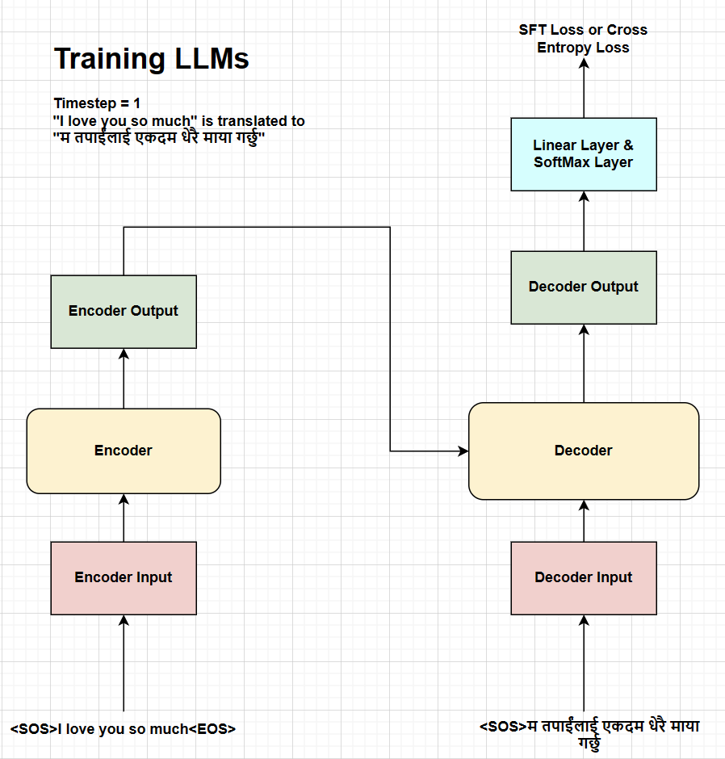
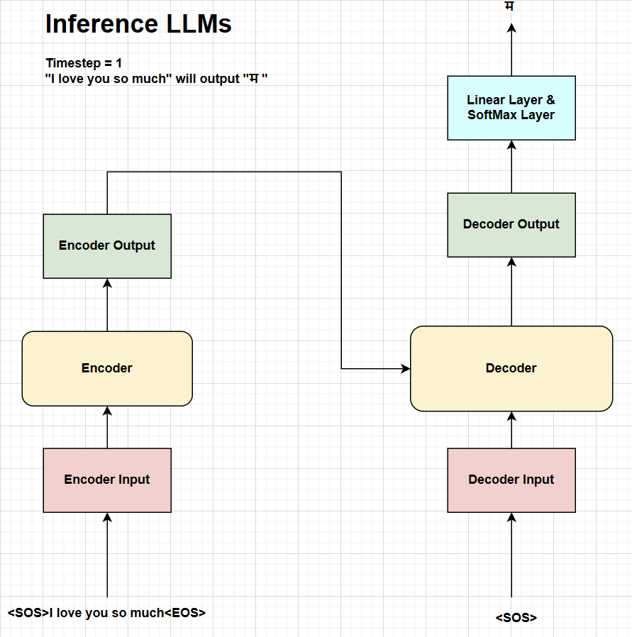
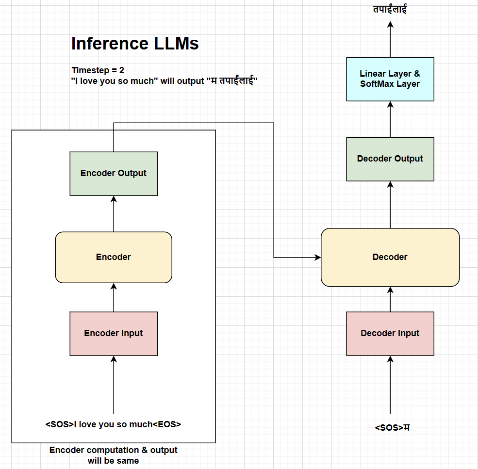
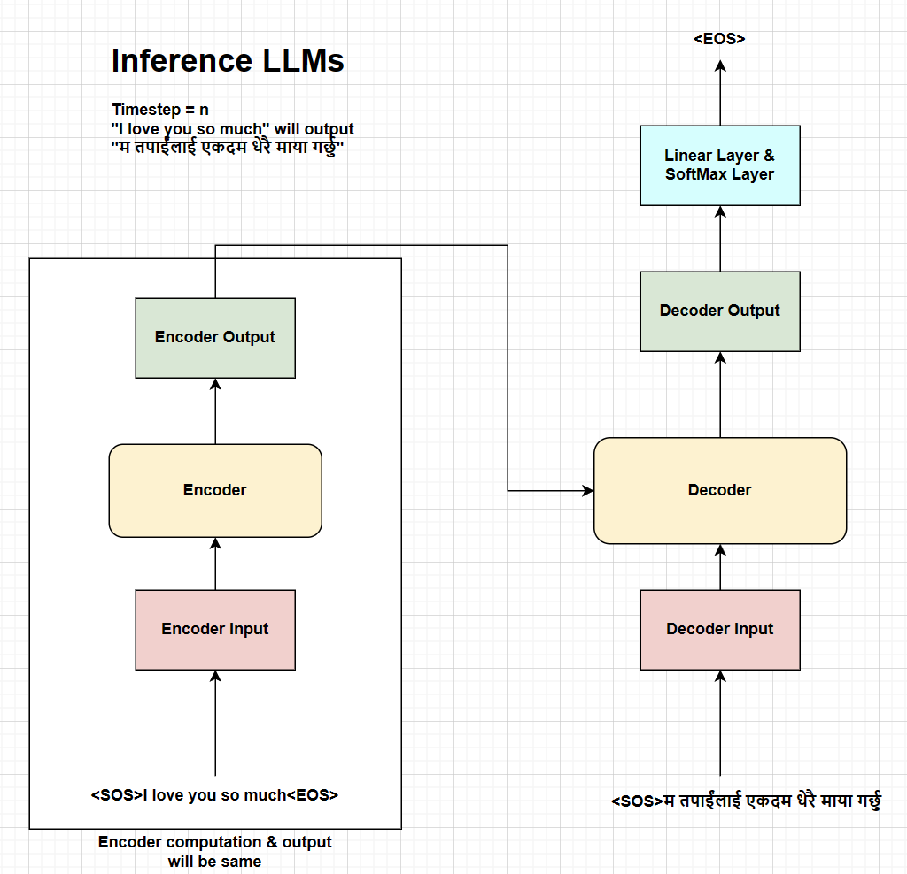

## **Introduction to LLMs**
Language models are the probabilistic models that assigns probability to the sequence of words. In other words, language models assigns the probability of generating a next token given the sequence of previous tokens. These models generate the complete answer for the given prompt using the iterative approach of predicting the next token and appending the generated token to the input prompt to generate the next token until the sequence of desired length is generated. We need to understand the engineering tradeoffs for inference of these large language models (LLMs) because use cases of these models are growing rapidly throughout application areas.

## **Parallel Training of LLMs**
Let's consider that we want to train a transformer model for the language translation task where we want to convert the english sentence to nepali sentence. Our english text is "I love you so much" and the corresponding nepali text is "म तपाईंलाई एकदम धेरै माया गर्छु". 

The training process can be broken down into the following steps:
1. First, we need to append the start token `<SOS>` and end token `<EOS>` to the source sentence which becomes `<SOS> I love you so much <EOS>`. Then we will prepare the encoder input by tokenizing, embedding, and adding positional encoding to the source sentence. The encoder input is then passed through the encoder which gives the encoder output which is used as the key and value for the decoder.
2. The decoder input is prepared by appending only the start token `<SOS>` to the target sentence which becomes `<SOS> म तपाईंलाई एकदम धेरै माया गर्छु` and undergoes the same process of tokenizing, embedding, and adding positional encoding. The decoder input is then passed through the decoder along with the encoder output which gives the decoder output.
3. The decoder output is then passed through the projection layer and softmax layer to get the probability distribution of the next token. We then calculate the cross-entropy loss between the predicted tokens and the actual target tokens. At each timestep, the model obtains the complete sequence of tokens in parallel during the training process.

<div style="display: flex; flex-direction: column; align-items: center;">

<p style="text-align: center;">Fig. Training process at timestep 1.</p>
</div>

As shown in the figure above, language models are trained using the sequence parallelism approach where the model generates the desired sequence of tokens in parallel at each timestep.

## **Scaling LLMs**
The efficient scaling of large language models can unlock the new capabilities & applications but has fundamental tradeoffs in terms of inference cost, memory footprint, and parallelizability. The inference cost of LLMs can be measured in terms of the following metrics:

1. **Latency**: The latency is the total time taken for inference of the model which can be broken down into the time to process the input tokens present at the start of the inference i.e. **prefill** and the time to autoregressively generate the output tokens i.e. **decode**. The decode latency can also be measured **per step** i.e. divided by the number of tokens in each sequence.

2. **Throughput**: The throughput of prefill or decode is the number of tokens processed or generated per second. 

3. **Model FLOPS utilization (MFU)**: The MFU is the ratio of the observed throughput to the theoretical maximum throughput of the model. This metric should be measured with no memory or communication overhead. 

## **Challenges at Inference**
The generative inference of LLMs is challenging due to the following reasons:

1. **Large memory footprint**: Large language models have large memory footprint both due to the trained model parameters as well as the transient memory state needed for decoding. The KV cache [4](#references) for each layers must be stored in memory for the entire duration of the decoding process. Thus, the model parameters usually do not fit in a single GPU memory, which requires the model to be partitioned across multiple GPUs [2](#references).

2. **Low parallelizability**: Generative inference of LLMs is inherently sequential due to the autoregressive nature and the computation for each token is dependent on the previous tokens. This makes it difficult to parallelize the inference process.

Therefore, the inference cost of LLMs increases quadratically with the sequence length from the attention mechanism. The attention mechanism computes the attention scores between each tokens in the sequence [3](#references).

Let's consider the task mentioned above where we want to convert the english sentence to nepali sentence. The input english text is "I love you so much" and the corresponding nepali text is "म तपाईंलाई एकदम धेरै माया गर्छु".

The inference process of generative LLMs can be broken down into the following steps:
1. So, we need to append the start token `<SOS>` and end token `<EOS>` to the source sentence which becomes `<SOS> I love you so much <EOS>`. Then we will prepare the encoder input by tokenizing, embedding, and adding positional encoding to the source sentence. The encoder input is then passed through the encoder which gives the encoder output which is used as the key and value for the decoder. Please note that the encoder output remains the same for all the timesteps at inference.
2. The first decoder input is just the start token `<SOS>` which undergoes the same process of tokenizing, embedding, and adding positional encoding. The decoder input is then passed through the decoder along with the encoder output which gives the decoder output. The decoder output is then passed through the projection layer and softmax layer to get the probability distribution of the next token which is likely to be "म" in this case.
3. The generated token "म" is then appended to the decoder input which becomes "`<SOS> म`" and undergoes the same process of tokenizing, embedding, and adding positional encoding. The decoder input is then passed through the decoder along with the encoder output which gives the decoder output. The same process is repeated until the end token `<EOS>` is generated in the sequence and the encoder output will be the same for all the timesteps until the end token is generated.

<div style="display: flex; flex-direction: column; align-items: center;">

<p style="text-align: center;">Fig. Inference process at timestep 1.</p>
</div>

As shown in the figure above, the inference process at timestep 1 will generate the first token of the nepali sentence "म" using the input english text "I love you so much".

<div style="display: flex; flex-direction: column; align-items: center;">

<p style="text-align: center;">Fig. Inference process at timestep 2.</p>
</div>

Similarly, the inference process at timestep 2 will generate the second token of the nepali sentence "तपाईंलाई" which is appended to the decoder input and passed through the decoder to generate the next token.

<div style="display: flex; flex-direction: column; align-items: center;">

<p style="text-align: center;">Fig. Inference process at timestep N.</p>
</div>

Finally, the inference process at timestep N will generate the `<EOS>` token which will be the end of the inference process and the complete nepali sentence will be generated. In this way, the inference process of generative LLMs is autoregressive and sequential in nature.

### **Implementation of Inference**
The inference process of generative LLMs can be implemented using the following code snippet. The code snippet follows the same process as mentioned above where we generate the next token at each timestep and append it to the decoder input until the end token is generated. You can find the complete code implementation [here](https://github.com/ThinamXx/transformer-pytorch/tree/main/transformer) [5](#references). 

```python
# translate the sentence.
model.eval()
with torch.no_grad():
    # precompute the encoder output and reuse it for every generation step.
    source = tokenizer_src.encode(sentence)
    source = torch.cat(
        [
            torch.tensor([tokenizer_src.token_to_id("[SOS]")], dtype=torch.int64),
            torch.tensor(source.ids, dtype=torch.int64),
            torch.tensor([tokenizer_src.token_to_id("[EOS]")], dtype=torch.int64),
            torch.tensor(
                [tokenizer_src.token_to_id("[PAD]")]
                * (seq_len - len(source.ids) - 2),
                dtype=torch.int64,
            ),
        ],
        dim=0,
    ).to(device)
    source_mask = (
        (source != tokenizer_src.token_to_id("[PAD]"))
        .unsqueeze(0)
        .unsqueeze(0)
        .int()
        .to(device)
    )
    encoder_output = model.encode(source, source_mask)

    # initialize the decoder input with the sos token.
    decoder_input = (
        torch.empty(1, 1)
        .fill_(tokenizer_tgt.token_to_id("[SOS]"))
        .type_as(source)
        .to(device)
    )

    # generate the translation word by word.
    while decoder_input.size(1) < seq_len:
        # build mask for target and calculate output.
        decoder_mask = (
            torch.triu(
                torch.ones((1, decoder_input.size(1), decoder_input.size(1))),
                diagonal=1,
            )
            .type(torch.int)
            .type_as(source_mask)
            .to(device)
        )
        out = model.decode(encoder_output, source_mask, decoder_input, decoder_mask)

        # project next token.
        prob = model.project(out[:, -1])
        _, next_word = torch.max(prob, dim=1)
        decoder_input = torch.cat(
            [
                decoder_input,
                torch.empty(1, 1)
                .type_as(source)
                .fill_(next_word.item())
                .to(device),
            ],
            dim=1,
        )

        # break if we predict the end of sentence token.
        if next_word == tokenizer_tgt.token_to_id("[EOS]"):
            break
```

## **Parallel Transformer Blocks**
The parallel formulation of transformer blocks was introduced by [Wang & Komatsuzaki 7](#references). They mentioned that the parallel formulation results in roughly 15% faster training speed at large scales, since the FFN and Attention input matrix multiplication can be fused.

Specifically, the standard "serialized" formulation can be written as:  
$y = x + FFN(LayerNorm(x + Attention(LayerNorm(x))))$  

Whereas, the parallel formulation can be written as:  
$y = x + FFN(LayerNorm(x)) + Attention(LayerNorm(x))$

There are inference latency gains from the parallel formulation of each transformer block instead of the serialized formulation, where the feedforward layer and attention layer can be computed in parallel from the layer normalization output and summed together to get the final output. 

The major benefits of the parallel formulation of transformer blocks are:
1. There is only one layer normalization operation per layer instead of two which reduces latency at small batch sizes. 
2. The input matrices of the feedforward layer can be fused with the query projection matrix $W_q$ of the attention layer, the key and value projection matrices $W_k$ and $W_v$ can be fused in the attention layer, and the output of the feedforward layer can be fused with the output projection matrix $W_o$ of the attention layer. This fusion operation results in higher FLOPS utilization because the larger matrix multiplications run more efficiently.

### **Implementation of Parallel Transformer Blocks**
The parallel transformer blocks can be implemented using the following code snippet. The code snippet follows the same process as mentioned above where the feedforward layer and attention layer can be computed in parallel from the layer normalization output and summed together to get the final output. You can find the complete code implementation [here](https://github.com/ThinamXx/Meta-llama.git) [8](#references).

```python
class ParallelTransformerBlock(nn.Module):
    """
    Mentioned in the paper: https://arxiv.org/pdf/2204.02311 at model architecture section.
    """

    def __init__(
        self,
        args: ModelArgs,
    ):
        super().__init__()
        self.attention = GroupedQueryAttentionLLAMA(args)
        self.feed_forward = FeedForwardBlock(args)

        # normalization before attention block and feed forward block
        self.rms_norm = RMSNorm(args)

    def forward(
        self,
        x: torch.Tensor,
        start_pos: int,
        freqs_complex: torch.Tensor,
        mask: Optional[torch.Tensor],
    ):
        norm_x = self.rms_norm(x)

        # (batch_size, seq_len, d_model) --> (batch_size, seq_len, d_model)
        h = x + self.attention.forward(
            norm_x,
            freqs_complex=freqs_complex,
            start_pos=start_pos,
            mask=mask,
        )

        out = h + self.feed_forward.forward(norm_x)
        return out
```

## **Conclusions**
Therefore, this blog post provides an overview of the inference process of generative LLMs and the challenges faced during the inference process. The inference process of generative LLMs is autoregressive and sequential in nature which makes it difficult to parallelize the inference process. The parallel transformer blocks can be used to reduce the inference latency by computing the feedforward layer and attention layer in parallel from the layer normalization output and summed together to get the final output. This blog also explains the parallel training of LLMs and the engineering tradeoffs for inference of these large language models.

## **References**
1. Pope, R., Douglas, S., Chowdhery, A., Devlin, J., Bradbury, J., Levskaya, A., Heek, J., Xiao, K., Agrawal, S., & Dean, J. (2022). Efficiently Scaling Transformer Inference. ArXiv. /abs/2211.05102
2. [Model Sharding by Thinam Tamang](https://thinamxx.github.io/blog/posts/MS/mistral.html).
3. [Grouped Query Attention by Thinam Tamang](https://thinamxx.github.io/blog/posts/GQA/gqa.html).
4. [Understanding KV Cache by Thinam Tamang](https://thinamxx.github.io/blog/posts/KV/kv.html).
5. [Transformer Implementation by Thinam Tamang](https://github.com/ThinamXx/transformer-pytorch/tree/main/transformer).
6. [Umar's YouTube Channel](https://www.youtube.com/@umarjamilai/videos).
7. [GPT-J-6B: A 6 Billion Parameter Autoregressive Language Model](https://github.com/kingoflolz/mesh-transformer-jax)
8. [LLama Implementation by Thinam Tamang](https://github.com/ThinamXx/Meta-llama.git).