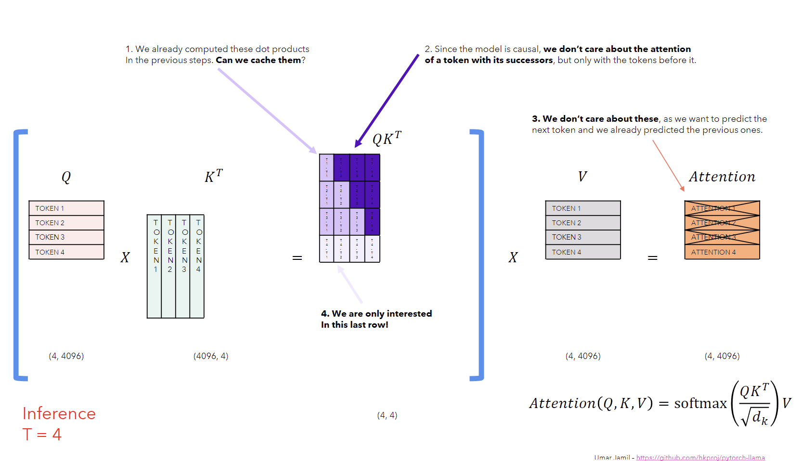
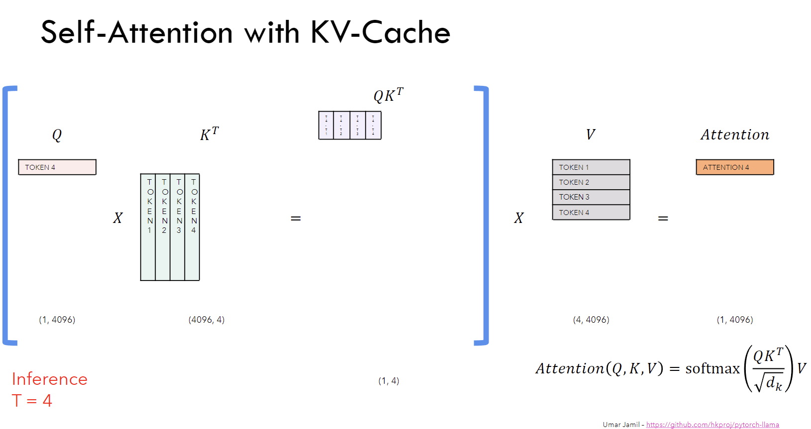
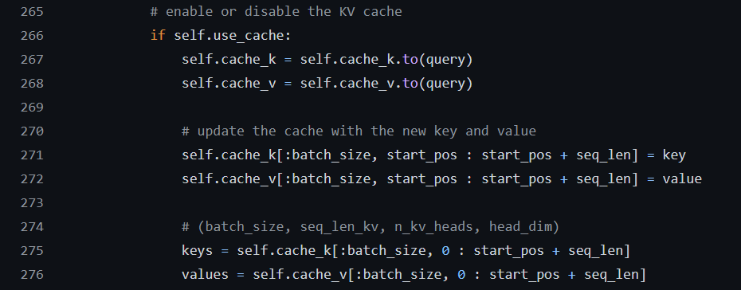

In this article, we will discuss the Key-Value cache. We will start with the introduction of the Key-Value cache, then we will discuss the problem, solution, limitations, and implementation of the Key-Value cache. You can also watch the video by [Umar Jamil](https://www.linkedin.com/in/ujamil/) on the Key-Value cache [here](https://www.youtube.com/watch?v=Mn_9W1nCFLo&t=2811s).

### **Introduction**  
KV cache, short for Key Value cache, is a technique used to accelerate the inference process in Large Language Models (LLMs), particularly in autoregressive models i.e. the current token depends on the previous tokens in a sequence. In these models, the tokens are generated one by one which can be computationally expensive because it repeats certain computations at each time step. The KV cache technique is only used during the inference process and not during the training process. 

In the KV cache, the output of the model from previous time step is appended to the cache of key and value matrices of the current time step but the query matrix is updated at each time step to generate the next token. This way of caching the previous keys and values ensures that the model does not repeat the computations at each time step. This significantly reduces the size of the matrices used in the computation which makes the inference process faster (matrix multiplication faster). 

### **Why do we need a Key-Value cache?**  
Suppose, we want to generate `I saw a beautiful car [EOS]` where `[EOS]` is the end of the sentence token. The model will generate the tokens one by one at each time step. If we want to predict the token `car`, the model will generate the token `I` first, then `saw`, then `a`, and so on. The problem is that the model will generate the token `I` every time it wants to predict the next token which is waste of computation because the token `I` is the same for every time step. So, we need a technique called Key-Value cache to solve this problem.

    
    
Fig a. The image taken from Umar's video clearly presents the problem in typical Self-Attention computations.

The image above shows the attention computation at inference time step 4. We multiply the query matrix with the transpose of the key matrix to get the attention scores. Then we apply the softmax function to the attention scores to get the attention weights. Finally, we multiply the attention weights with the value matrix to get the attention output. This is the typical self-attention computation used in all transformer models. Since, the model is causal (i.e. the attention of a token only depends on the preceding token), we only need the last row of the attention scores matrix to ge the desired attention output for the current token. This means that we don't need extra computations of matrix multiplication, which is resolved by the KV cache technique.

### **How does KV cache solve the problem?**  
With the KV cache, we cache the previous Key and Value matrices and focus only on computing the attention scores for the current token. The query matrix is updated at each time step to generate the next token. This way of caching the previous keys and values ensures that the model does not repeat the computations at each time step. This significantly reduces the size of the matrices used in the computation which makes the inference process faster. 

    
    
Fig b. The image taken from Umar's video clearly presents the efficient computation of attention with KV cache technique.

The image above shows the attention computation at inference time step 4 with KV cache. We cache the key and value matrices from the previous time step and only compute the attention scores for the current token. This way, we don't need to repeat the computations at each time step and get the desired attention output for the current token as shown in the image above.

### **What are the limitations of KV cache?**  
The only limitation of the KV cache is that the caching of the key and value requires more GPU memory (or CPU memory). At each time step during the generation process, the key and value matrices are appended to the cache which grows with the number of tokens generated and is stored in the memory. This becomes a bottleneck especially for large models with billions of parameters and long sequences.

### **How to implement a KV cache?** 
While working on the implementation of the [Llama 2: Open Foundation and Fine-Tuned Chat Models](https://ai.meta.com/research/publications/llama-2-open-foundation-and-fine-tuned-chat-models/), I implemented the KV cache in the Grouped Query Attention. The code snippet below shows the implementation of the KV cache.  

    
    
Fig c. Implementation of KV cache in Grouped Query Attention.

### **Conclusion**  
So, while KV caching can significantly speed up the inference process, it does so at the cost of increased memory usage. In this article, we discussed the Key-Value cache. We started with the introduction of the Key-Value cache, then we discussed the problem, solution, limitations, and the implementation of the KV cache in the Grouped Query Attention. You can also check my implementation of Llama 2 [here](https://github.com/ThinamXx/Meta-llama/blob/main/llama/llama2.py).

### **References**  
- [Umar's video on KV cache](https://www.youtube.com/watch?v=Mn_9W1nCFLo&t=2811s)
- [Llama2 Implementation](https://github.com/ThinamXx/Meta-llama/blob/main/llama/llama2.py)
- [Llama 2: Open Foundation and Fine-Tuned Chat Models](https://ai.meta.com/research/publications/llama-2-open-foundation-and-fine-tuned-chat-models/)
- [Attention Is All You Need](https://arxiv.org/abs/1706.03762)  