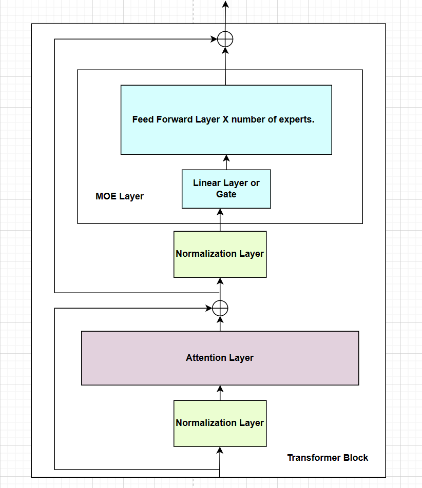

### **Introduction**

Mixture of Experts (MoE) is a neural network that divides the list of Modules into specialized experts, each responsible for processing specific tokens or aspects of the input data. This approach aims to optimize the memory usage and computational efficiency by activating only the necessary experts for a given input which allows for more efficient pretraining and faster inference. 

### **MoE in Mistral**

In my blog post on [Model Sharding](https://thinamxx.github.io/blog/posts/MS/mistral.html), I discussed the architecture of Mistral and how it uses model sharding to distribute the model parameters, gradients, and optimizer states across multiple GPUs along with diagrammatic representation. 

The architecture of Mistral contains an Embedding Layer, Transformer Block that contains [Attention Layers, MOE Layers or FeedForward Layers with or without Normalization Layers], and a Normalization Layer and a Linear Output Layer with Softmax. The Transformer Block is repeated n times where n is the number of layers in the model. So, the basic architecture of Mistral becomes **Embedding Layer -> Transformer Block -> Normalization Layer -> Linear Output Layer with Softmax**.

<div style="display: flex; flex-direction: column; align-items: center;">

<p style="text-align: center;">Fig a. Transformer Block of Mistral</p>
</div>

The Transformer Block in Mistral contains Normalization Layers before Attention Layers and before Mixture of Experts (MoE) Layer. The MoE Layer contains a Linear Layer which is also known as the Gate Layer that converts the input to the dimensions equal to the number of experts. The experts are the FeedForward Layers which are repeated n times where n is the number of experts. We extract the `top_k` logits or weights from the output of the Gate Layer and use them to select the `top_k` experts. We then create the sparse tensor matrix and use it to get the output from the selected experts. The MoE Layer is used in place of the FeedForward Layer in the Transformer Block. 

According to the [documentation of Mistral](https://github.com/ThinamXx/mistral-src/tree/main?tab=readme-ov-file#sparse-mixture-of-experts-smoe):  
_Sparse Mixture of Experts allows one to decouple throughput from memory costs by only activating subsets of the overall model for each token. In this approach, each token is assigned to one or more "experts" -- a separate set of weights -- and only processed by sunch experts. This division happens at feedforward layers of the model. The expert models specialize in different aspects of the data, allowing them to capture complex patterns and make more accurate predictions._

It means that MoE aims to balance the computation efficiency or throughput and memory requirements by activating only the necessary experts for a given input which takes place at the feedforward layers of the model. Each expert specializes in different aspects of the data which allows them to capture complex patterns in the data instead of using a single feedforward network for the entire data.

### **Implementation**
As shown in the diagram above, the MoE Layer contains a Linear Layer (Gate Layer) and a list of Modules of FeedForward Layers (Experts). The implementation of MoE Layer in Mistral is as follows:

```python
@dataclasses.dataclass
class MoeArgs(Serializable):
    num_experts: int
    num_experts_per_tok: int


class MoeLayer(nn.Module):
    def __init__(self, experts: List[nn.Module], gate: nn.Module, moe_args: MoeArgs):
        super().__init__()
        assert len(experts) > 0
        self.experts = nn.ModuleList(experts)
        self.gate = gate
        self.args = moe_args

    def forward(self, inputs: torch.Tensor):
        gate_logits = self.gate(inputs)
        weights, selected_experts = torch.topk(
            gate_logits, self.args.num_experts_per_tok
        )
        weights = F.softmax(weights, dim=1, dtype=torch.float).to(inputs.dtype)
        results = torch.zeros_like(inputs)
        for i, expert in enumerate(self.experts):
            batch_idx, nth_expert = torch.where(selected_experts == i)
            results[batch_idx] += weights[batch_idx, nth_expert, None] * expert(
                inputs[batch_idx]
            )
        return results
```

### **Conclusion**
Mixture of Experts (MoE) is a neural network that divides the list of Modules into specialized experts in order to optimize the memory usage and computational efficiency by activating only the necessary experts for a given input. The MoE Layer is used in place of the FeedForward Layer in the Transformer Block of Mistral which contains a Linear Layer (Gate) and a list of Modules (FeedForward) Layers. 

### **References**
- [Mistral Source Code](https://github.com/ThinamXx/mistral-src)
- [Llama2 Implementation](https://github.com/ThinamXx/Meta-llama/blob/main/llama/llama2.py)
- [Attention Is All You Need](https://arxiv.org/abs/1706.03762)  