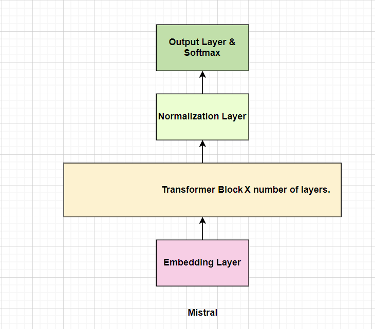
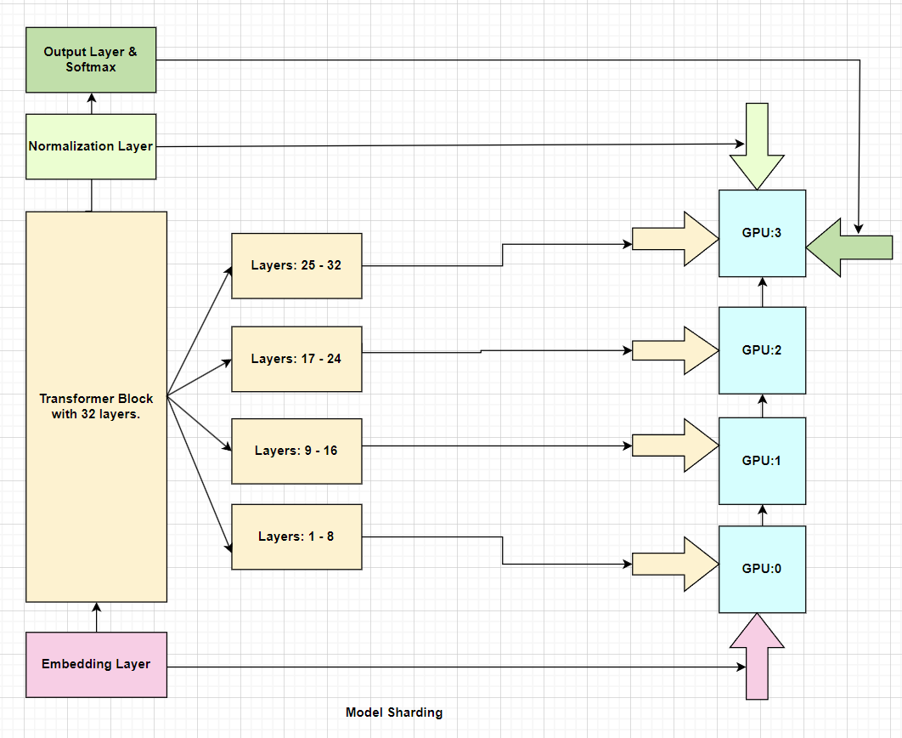

### **Introduction**
Model Sharding is a technique used to distribute the model parameters, gradients, and optimizer states across multiple GPUs. In this technique, the model is divided into multiple portions, and each portion is assigned to a different GPU. 

### **Why Model Sharding?**
In the traditional data parallelism approach, each GPU maintains a full copy of the model parameters, gradients, and optimizer states which requires the entire model to fit into the memory of each GPUs. This becomes challenging when the model size is very large and the memory of each GPU is limited. Model sharding is a solution to this problem. It allows the model to be distributed across multiple GPUs, and each GPU only maintains a portion of the model which allows the model to scale to larger sizes.

### **Model Sharding in Mistral**

Mistral Architecture Details based on [source code](https://github.com/ThinamXx/mistral-src/blob/main/mistral/model.py):  

1. The architecture of Mistral contains an Embedding Layer, Transformer Block that contains [Attention Layers, MOE Layers or FeedForward Layers with or without Normalization Layers], and a Normalization Layer and a Linear Output Layer with Softmax.  

2. The Transformer Block is repeated n times where n is the number of layers in the model. So, the basic architecture of Mistral becomes Embedding Layer -> Transformer Block -> Normalization Layer -> Linear Output Layer with Softmax.

Fig a. Basic architecture of Mistral

Model Sharding in Mistral is implemented in such a way that a number of layers of the model are assigned to one GPU, and the rest to other GPUs and so on which basically distributes the model across multiple GPUs. Suppose we have the model with 32 layers and using 4 GPUs, then 8 layers will be assigned to each GPU. The Embedding Layer along with the first 8 layers of Transformer Block (TB) will be assigned to the first GPU, the next 8 layers of TB to the second GPU, the next 8 layers of TB to the third GPU, and the last 8 layers of TB with the Normalization Layer and Linear Output Layer with Softmax will be assigned to the fourth or last GPU.

Fig b. Model Sharding in Mistral with 32 layers and 4 GPUs.

### **Conclusion**
Model Sharding is a technique used to distribute the model across multiple GPUs where the output of one GPU is used as the input to the next GPU. This technique allows the model to scale to larger sizes. Mistral uses this technique to distribute the model across multiple GPUs. This technique is very useful when the model size is very large (in terms of parameters in millions or trillions and the memory of each GPU is limited to fit the entire model in each single GPUs.)

### **References**
- [Mistral Source Code](https://github.com/ThinamXx/mistral-src)
- [Llama2 Implementation](https://github.com/ThinamXx/Meta-llama/blob/main/llama/llama2.py)
- [Attention Is All You Need](https://arxiv.org/abs/1706.03762)  