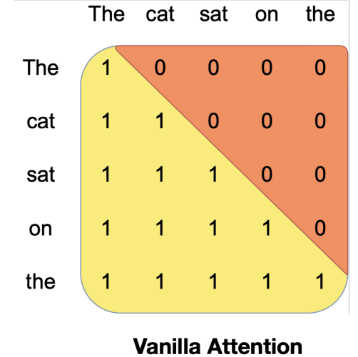
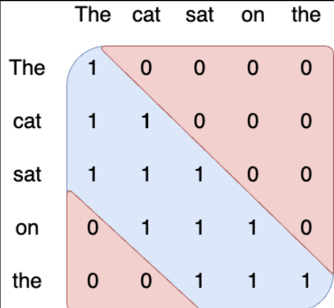
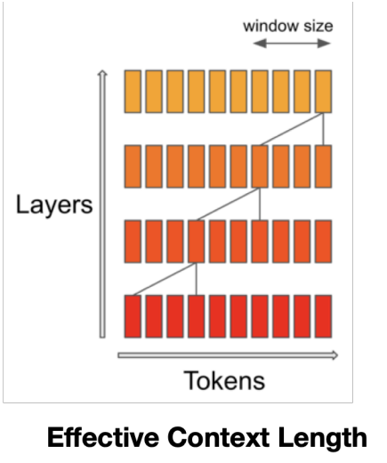
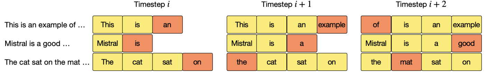
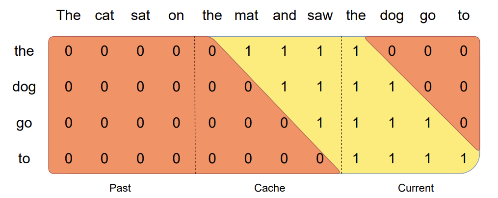

## **Sliding Window Attention**
Attention mechanism is a key component in Transformer models. It allows the model to focus on different parts of the input sequence and derive the relationship between tokens of the input sequence. In other words, Attention refers to the mechanism of sharing the information between tokens in the input sequence. For the computation of attention in Transormer Models:

- We multiply the _query matrix_ with the transpose of the _key matrix_ to get the attention scores. The attention scores are then fed to the _softmax function_ to get the attention weights. These attention weights are then multiplied with the _value matrix_ to get the context vector or attention output. 

In vanilla Transformer models, the attention mechanism uses _causal mask_ which means that each token in the input sequence can only attend to itself and all the tokens before it. This approach ensures that the model is causal and it can only use the information from the past tokens to predict the future tokens. However, the number of operations in the attention mechanism is quadratic with respect to the length of the input sequence and the memory requirement is also linear with respect to the length of the input sequence which incurs higher latency and smaller throughput from the model at inference time. 

Fig a. Vanilla Attention with causal mask taken from Mistral paper.

So, to address these limitations, **Sliding Window Attention** mechanism was used in the Mistral model. The Sliding Window Attention is a variant of the attention mechanism which uses a fixed window size to select the tokens from the past to attend for computation of attention output. In other words, each token in the input sequence can only attend at most **W** tokens from the past where **W** is the window size. This approach increases the inference speed and reduces the memory usage of the model. This mechanism still ensures that the model is causal but it does not use the entire tokens from the past, whereas it uses a fixed number of tokens from the past to compute the attention output. 

Fig b. Sliding Window Attention with window size 3.

In the **Sliding Window Attention**, the tokens outside the sliding window still influence the next word prediction because at each attention layer, the information can move forward by **W** tokens at most, but after the next layer, the information can move forward by **2W** tokens and so on, as the hidden state in position **i** of the layer **k**, attends to all the hidden states from position **i-W** to **i** of the layer **k-1** since the layers are stacked on top of each other in Transformer models. 

Suppose, we have a input sequence with 10 tokens, a Transformer model with 4 layers and using a window size of 4,then the information flow from one layer to another using Sliding Window Attention is given below:

- In first layer, we use the first 4 tokens to compute the attention output for the next token. 
- In second layer, we use the information from the previous 4 tokens and the next 3 tokens to compute the attention output for the next token.
- In third layer, we use the information from the previous tokens and the next 3 tokens compute the attention output for the next token.
- In fourth layer, we use the information of the entire input sequence to compute the attention output for the next token. At this point, the information has propagated from the first token to the last token in the input sequence. 

Fig c. Information flow from one layer to another using Sliding Window Attention.

## **Rotating Buffer Cache**  
**Rotating Buffer Cache** is a mechanism used in the Mistral model which limits the size of _KV_ cache to a fixed size. In my blog post on [Understanding KV Cache](https://thinamxx.github.io/blog/posts/KV/kv.html), I have explained the needs and limitations of KV cache along with implementation. In the paper of Mistral, they mentioned that: when we use a sequence length of **32k** tokens, the Rotating Buffer Cache reduces the cache memory usage by **8x**, without impacting the model quality. While using KV cache, the memory usage of GPU or CPU increases linearly with respect to the length of the input sequence because we need to save KV cache for each layers of the model. 

### **Rotating Buffer Cache for Sliding Window Attention**
When we use **Sliding Window Attention** mechanism, we have the fixed attention span of **W** tokens which means that we can limit the size of the _KV_ cache using the **Rotating Buffer Cache** also called **Rolling Buffer Cache**. The cache has a fixed size of **W** where **W** is the window size, and the Keys and Values for the timestep **i** are stored in the positions **i mod W** of the cache. Similarly, when the position **i** is larger than **W**, the previous Keys and Values are overwritten by the new Keys and Values in the cache. This approach keeps the cache size fixed and reduces the linear memory usage of the model with respect to the length of the input sequence. 

Fig d. Rotating Buffer Cache with cache size W=4

In the above figure, the cache size is **W=4** and we have 3 input sequences. The Keys and Values are stored by following operations:

- We have 3 input sequences: 
    - "This is an example of ..."
    - "Mistral is a good ..."
    - "The cat sat on the mat ..."
- For the first input sequence, at timestep **i**, "an" is stored in the cache position **2 mod 4 = 2**. At timestep **i+1**, "example" is stored in the cache position **3 mod 4 = 3**. At timestep **i+2**, "of" is stored in the cache position **4 mod 4 = 0**.
- For the second input sequence, at timestep **i**, "is" is stored in the cache position **1 mod 4 = 1**. At timestep **i+1**, "a" is stored in the cache position **2 mod 4 = 2**. At timestep **i+2**, "good" is stored in the cache position **3 mod 4 = 3**.
- For the third input sequence, at timestep **i**, "on" is stored in the cache position **3 mod 4 = 3**. At timestep **i+1**, "the" is stored in the cache position **4 mod 4 = 0**. At timestep **i+2**, "mat" is stored in the cache position **1 mod 4 = 1**.

## **Pre-Filling and Chunking**
When we generate the sequence using the model at inference time, we need to generate the tokens one by one as each token is dependent on the previous tokens. The output of the model when we use self attention mechanism without KV cache is a sequence of tokens whereas the output of the model when we use KV cache is a required final token. Therefore, KV cache makes the inference faster.

At inference, the prompt sequence is known in advance, and we can pre-fill the KV cache with the prompt sequence. In the Sliding Window Attention mechanism, we have the fixed size of the cache and if the prompt sequence is larger than the cache size, we can chunk the prompt sequence into smaller sequences and pre-fill the cache with these smaller sequences. In this approach, we use the chunk size of **W** where **W** is the window size.

Suppose, we have a prompt sequence "The cat sat on the mat and saw the dog go to" and the window size is **W=4**, then we can chunk the prompt sequence into smaller sequences as follows:
- "The cat sat on"
- "the mat and saw"
- "the dog go to"

Fig e. Pre-fill and Chunking representation taken from Mistral

In the above figure, the prompt sequence is chunked into smaller sequences and the cache is pre-filled with these sequences. For the third chunk "the dog go to": it attends itself using the causal mask which is the rightmost block, and it attends the previous block using the sliding window attention mechanism, and it does not attend any past tokens that is outside the window size of sliding window attention.

Therefore, pre-filling is the process of filling the KV cache with the prompt sequence and chunking is the process of dividing the prompt sequence into smaller sequences and pre-filling the cache with these smaller sequences.

### **BlockDiagonalCausalMask and BlockDiagonalMask during Pre-Filling**
We use the **Pre-Filling** and **Chunking** mechanism to pre-fill the KV cache with the prompt sequence. Both the **BlockDiagonalCausalMask** and **BlockDiagonalMask** are used to pre-fill the cache and [generate the mask](https://github.com/ThinamXx/mistral-src/blob/main/mistral/cache.py#L237C9-L260C14) of each chunk of the prompt sequence. The generated mask is then used to compute the [attention](https://github.com/ThinamXx/mistral-src/blob/main/mistral/model.py#L114C9-L117C10) by the Attention Layer in Mistral model. The generation of the mask is done by the following operations:

- Let's say we have a prompt sequence "The cat sat on" and we want to generate the 4 new tokens. The cache size will be **max_tokens + prompt_length + 1 = 4 + 4 + 1 = 9**.
- Suppose, we consider the chunk size of 2, then the prompt sequence is divided into 3 chunks because while encoding the prompt sequence, we need to add the start token at index 0 during the inference, so the prompt sequence is divided into 3 chunks: "[start token] The, "cat sat", "on". You can find the implementation of chunking in [here](https://github.com/ThinamXx/mistral-src/blob/main/main.py#L76C5-L80C43).
- So, the prefill or mask for the first chunk is generated by **BlockDiagonalCausalMask** and the prefill or mask for the second (or subsequent chunks if any) is generated by **BlockDiagonalMask**. In our example above, we have the last chunk that doesn't contain the complete tokens as the chunk size has only one token, and in such cases, the prefill or mask is generated by **BlockDiagonalCausalWithOffsetPaddedKeysMask**. 

So, the **BlockDiagonalCausalMask** is used to pre-fill the cache with the first chunk of the prompt sequence and the **BlockDiagonalMask** is used to pre-fill the cache with the subsequent chunks of the prompt sequence. You can find the implementation of these masks in the [cache.py](https://github.com/ThinamXx/mistral-src/blob/main/mistral/cache.py#L237C9-L260C14). 

## **BlockDiagonalCausalWithOffsetPaddedKeysMask for Token Generation**
When we generate the tokens using the model at inference time, we need to generate the tokens one by one as each token is dependent on the previous tokens. In Mistral, the **BlockDiagonalCausalWithOffsetPaddedKeysMask** is used to generate the mask when we feed a single token to the model to generate the next token. Therefore, the **BlockDiagonalCausalWithOffsetPaddedKeysMask** is used to generate the mask for the token generation. You can find the implementation of generating a new token in [here](https://github.com/ThinamXx/mistral-src/blob/main/main.py#L132C9-L135C52) which then uses the **BlockDiagonalCausalWithOffsetPaddedKeysMask** to generate the mask for the generation of the next token.

### **How multiple prompts are handled in Mistral?**  
In Mistral model, multiple prompts are packed into a single tensor during pre-filling phase at inference time and the corresponding mask is generated using the **BlockDiagonalCausalMask**, **BlockDiagonalMask** and **BlockDiagonalCausalWithOffsetPaddedKeysMask**. The packed tensor is then send to the model to pre-fill the cache and generate the mask for the token generation. You can find the implementation of packing the prompts into a single tensor and generating the mask in [here](https://github.com/ThinamXx/mistral-src/blob/main/main.py#L83C5-L91C10).

## **KV Cache**
KV cache, short for Key & Value cache, is a technique used to accelerate the inference process in Large Language Models (LLMs), particularly in autoregressive models i.e. the current token depends on the previous tokens in a sequence. In the KV cache, the output of the model from previous time step is appended to the cache of key and value matrices of the current time step but the query matrix is updated at each time step to generate the next token. This way of caching the previous keys and values ensures that the model does not repeat the computations at each time step. This significantly reduces the size of the matrices used in the computation which makes the inference process faster (matrix multiplication faster). I have explained KV cache in detail along with its implementation in my blog post on [Understanding KV Cache](https://thinamxx.github.io/blog/posts/KV/kv.html).

### **KV Cache in Pre-Filling and Chunking**
Pre-filling is the process of filling the KV cache with the prompt sequence and chunking is the process of dividing the long prompt sequence into smaller sequences and pre-filling the cache with these smaller sequences as explained above. Since, we divide the prompt sequence into smaller sequences or chunks to pre-fill the cache, the dimensions of the KV cache changes at each iteration of the pre-filling process. The complete operation of pre-filling is done by the following operations:

- Let's say we have a [prompt sequence](https://github.com/ThinamXx/mistral-src/blob/main/main.py#L185C5-L194C33) "This is another great test" and after encoding we will have encoded prompt sequence of length 6 because we need to add the start token at index 0 during the inference. 
- Suppose, we consider the [chunk size](https://github.com/ThinamXx/mistral-src/blob/main/main.py#L77C5-L80C43) of 2, then the prompt sequence is divided into 3 chunks: "[start token] This", "is another", "great test".
- For the first chunk, the KV cache sequence length is 0, and since the chunk size is 2, the KV cache dimension is `[2, 8, 128]` where 2 is sequence length, 8 is the number of KV heads, and 128 is the head dimension. 
- For the second chunk, the KV cache sequence length is 2, and since the chunk size is 2, the KV cache dimension now becomes `[4, 8, 128]` where 4 is the sequence length, 8 is the number of KV heads, and 128 is the head dimension.
- For the third and last chunk, the KV cache sequence length is 4, and since the chunk size is 2, the KV cache dimension now becomes `[6, 8, 128]` where 6 is the sequence length, 8 is the number of KV heads, and 128 is the head dimension. 

So, the KV cache is pre-filled with the prompt sequence and the dimensions of the KV cache changes at each iteration of the pre-filling process. You can check the dimensions of the KV cache at each iteration of the pre-filling process in the [model.py](https://github.com/ThinamXx/mistral-src/blob/main/mistral/model.py#L96C9-L99C57). 

## **Conclusion**
In this blog post, I have explained the Sliding Window Attention mechanism, Rotating Buffer Cache, Pre-Filling and Chunking, BlockDiagonalCausalMask, BlockDiagonalMask, BlockDiagonalCausalWithOffsetPaddedKeysMask, and KV Cache in Mistral model. These techniques are used to accelerate the inference process as well as fine-tuning process in Large Language Models (LLMs). We prepare this blog post based on the source code of Mistral model and the paper of Mistral. You can learn more novel techniques used in Mistral model by reading my previous blog post on [Model Sharding](https://thinamxx.github.io/blog/posts/MS/mistral.html) and [Mixture of Experts](https://thinamxx.github.io/blog/posts/MOE/mistral.html).

## **References**
- [Mistral Source Code](https://github.com/ThinamXx/mistral-src)
- [Llama2 Implementation](https://github.com/ThinamXx/Meta-llama/blob/main/llama/llama2.py)
- [Attention Is All You Need](https://arxiv.org/abs/1706.03762)  