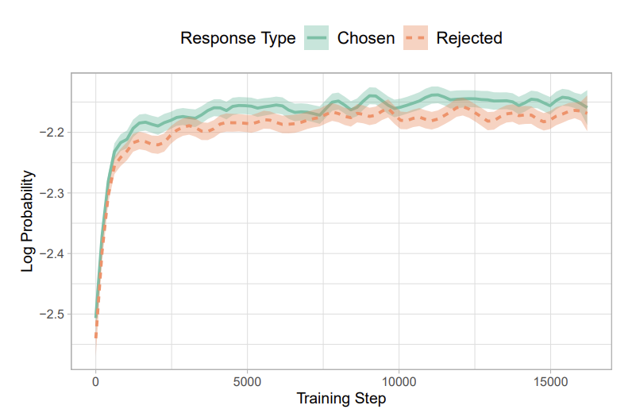

In this blog post, we will discuss the reference model free monolithic odds ratio preference optimization algorithm (ORPO) proposed in the paper [ORPO: Monolithic Preference Optimization without Reference Model](https://arxiv.org/abs/2403.07691). Most of the diagrams and equations are taken from the orginal [paper](https://arxiv.org/abs/2403.07691).

## **Introduction**
In order to make the pretrained large language models (LLMs) more useful in practice for general applications, it is important that they undergo the phases of **instruction tuning** and **preference tuning or alignment**. 

**Instruction tuning** is the process of fine-tuning the LLMs to follow the instructions given in the natural language text. This makes the LLMs more useful for the specific task at hand but it does not guarantee that the LLMs will generate the desired output which is not always harmful but can be in some cases.

Therefore, **Preference alignment** is the process of fine-tuning the LLMs to generate the output that aligns with the preferences of the user. We use pairwise preference data (e.g. A is chosen and B is rejected) to train the LLMs to generate the output that aligns with the preferences of the user. In our previous blog post on [PPO](https://thinamxx.github.io/blog/posts/PPO/ppo_loss.html), we discussed how to train the Reward model using the pairwise preference data. In this blog post, we will discuss the [ORPO](#orpo) algorithm which is a reference model free monolithic odds ratio preference optimization algorithm.

## **Supervised Fine-tuning (SFT)**
In reinforcement learning algorithms, such as PPO (Proximal Policy Optimization), the reward model is trained in such a way to maximize the score for the chosen answer resulting in models that are trained with human preferences. DPO (Direct Policy Optimization) combines the above mentioned step (i.e. reward model training) into the preference optimization step. 

Preference alignment methods in the context of reinforcement learning often leverage the SFT to ensure the stable update of the online policy (i.e. model being optimized) in relation to the offline policy (i.e. model used for sampling). If we study the loss function used in SFT, the goal of the cross-entropy loss is to penalize the model if the predicted logits for the reference answers are lower.  
$L_{SFT} = -\frac{1}{M} \sum_{k=1}^{M}\sum_{i=1}^{|V|} y_{i}^{k} \log p_{i}^{k}$  
where, $y_{i}^{k}$ is the boolean value indicating whether if the $i^{th}$ token in the vocabulary is the label token, $p_{i}^{k}$ is the probability of the $i^{th}$ token and $M$ is the length of the sequence. 

Using the above loss function, the model gives no penalty for the logits of the non-answer tokens. Therefore, the log probabilities of the tokens in the rejected answers increase along with the chosen answers, which is not desirable in preference alignment. 

<div style="display: flex; flex-direction: column; align-items: center;">

<p style="text-align: center;">Fig a. Log probabilities for chosen and rejected answers which shows comparable likelihood of generation.</p>
</div>

## **Odds Ratio Preference Optimization (ORPO)**
Let's consider an input sequence $x$, the average log-likelihood of generating the output sequence $y$, of length $m$ tokens is: $\log_\theta P(y|x) = \frac{1}{m} \sum_{i=1}^{m} \log P_\theta(y_i|x)$, where $\theta$ is the model parameters. Then the odds of generating the output sequence $y$ given the input sequence $x$ is: $odds_\theta(y|x) = \frac{P_\theta(y|x)}{1-P_\theta(y|x)}$. Thus, the odds ratio of choosen answer $y_w$ over the rejected answer $y_l$ is: $OR_\theta(y_w, y_l|x) = \frac{odds_\theta(y_w|x)}{odds_\theta(y_l|x)}$, which indicates that how likely the model is to generate the choosen output answer over the rejected output answer.

ORPO incorporates the odds ratio based loss to the original negative log-likelihood loss function for differentiating the likelihood of generating the choosen answer and the rejected answer.

<div style="display: flex; flex-direction: column; align-items: center;">

<p style="text-align: center;">Fig b. Comparison of model alignment techniques.</p>
</div>

ORPO aligns the language model without a reference model in a single-step by assigning a weak penalty to the log probabilities of the rejected answers and a strong adoption signal to the log probabilities of the choosen answers with a simple odds ratio based loss appended to the original negative log-likelihood loss function.

## **Objective Function & ORPO Loss**
The objective function of ORPO consists of two components:   
1. Supervised fine-tuning loss:  
$L_{SFT} = -\frac{1}{M} \sum_{k=1}^{M}\sum_{i=1}^{|V|} y_{i}^{k} \log p_{i}^{k}$.

2. Odds ratio loss:   
$L_{OR} = - log\sigma(log \frac{odds_\theta(y_w|x)}{odds_\theta(y_l|x)})$, where $\sigma$ is the sigmoid function.

Therefore, $L_{ORPO} = L_{SFT} + \lambda L_{OR}$, where $\lambda$ controls the pretrained language model to adopt to the specific subset of desired output and discourages the generation of the rejected answers. Log odds ratio loss is wrapped in the sigmoid function so that it can be minimized by increasing the log odds between $y_w$ and $y_l$.

### **Implementation of ORPO Loss**
```python
def compute_loss(model, inputs, return_outputs=False):
    """
    This is the original implementation of computing the ORPO loss function 
    added by the authors of the paper. Reference: https://github.com/xfactlab/orpo/blob/d13cdc025f942bdc49ba9c793350a3b1f2df25a0/src/orpo_trainer.py#L38
    """
    
    # Generate the hidden states for 'chosen' and 'reject'.
    neg_labels = inputs['negative_input_ids'].clone()
    pos_labels = inputs['positive_input_ids'].clone()

    # Generate the outputs for 'chosen' and 'reject'.
    outputs_neg = model(**{'input_ids': inputs['negative_input_ids'],
                            'attention_mask': inputs['negative_attention_mask'],
                            'labels': neg_labels,}, output_hidden_states=True)      
    outputs_pos = model(**{'input_ids': inputs['positive_input_ids'],
                            'attention_mask': inputs['positive_attention_mask'],
                            'labels': pos_labels,}, output_hidden_states=True)
        
    # Calculate NLL loss.
    pos_loss = outputs_pos.loss
    
    # Calculate the log probabilities of the 'chosen' and 'reject' outputs.
    pos_prob = self.compute_logps(prompt_attention_mask=inputs['attention_mask'],
                                    chosen_inputs=inputs['positive_input_ids'], 
                                    chosen_attention_mask=inputs['positive_attention_mask'], 
                                    logits=outputs_pos.logits)
    neg_prob = self.compute_logps(prompt_attention_mask=inputs['attention_mask'], 
                                    chosen_inputs=inputs['negative_input_ids'], 
                                    chosen_attention_mask=inputs['negative_attention_mask'], 
                                    logits=outputs_neg.logits)

    # Calculate the log odds and the ratio.
    log_odds = (pos_prob - neg_prob) - (torch.log(1 - torch.exp(pos_prob)) - torch.log(1 - torch.exp(neg_prob)))
    sig_ratio = torch.nn.functional.sigmoid(log_odds)
    ratio = torch.log(sig_ratio)
    
    # Calculate the ORPO loss.
    loss = torch.mean(pos_loss - self.alpha * ratio).to(dtype=torch.bfloat16)
    
    return (loss, outputs_pos) if return_outputs else loss
```

## **Conclusion**
In this blog post, we discussed the ORPO algorithm which is a reference model free monolithic odds ratio preference optimization algorithm. ORPO incorporates the odds ratio based loss to the original negative log-likelihood loss function for differentiating the likelihood of generating the choosen answer and the rejected answer. The ORPO loss function is a combination of the supervised fine-tuning loss and the odds ratio loss.

## **References**
1. Hong, J., Lee, N., & Thorne, J. (2024). ORPO: Monolithic Preference Optimization without Reference Model. ArXiv. /abs/2403.07691