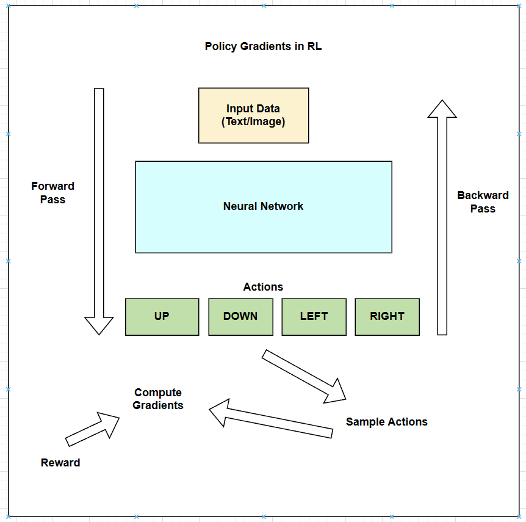
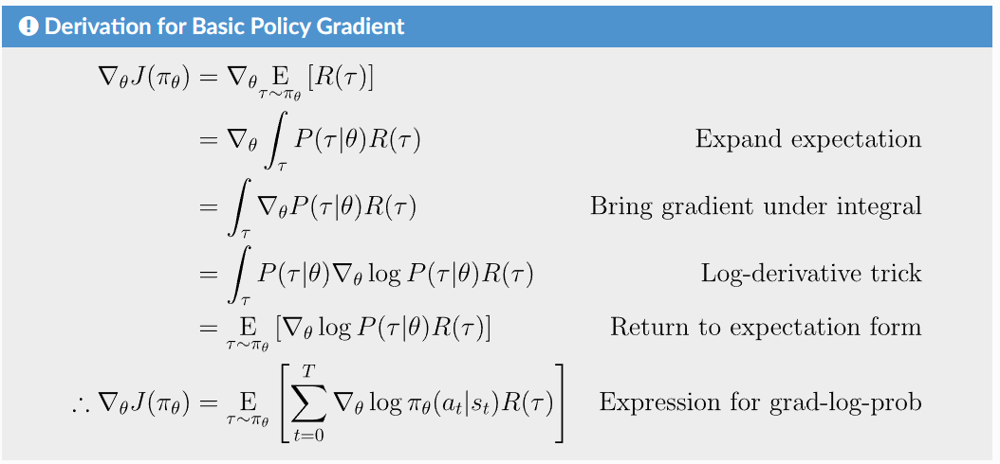

## **Gradient Descent**
To understand the Gradient Descent, we first need to understand the concept of a gradient. Slope is the rate of change of a vertical variable w.r.t the horizontal variable i.e. the ratio of vertical distance to horizontal distance. Derivative is the instantaneous rate of change of the function at a point. In other words, the derivate of a function at a point is the slope of the tangent line where the point touches the curve of the function. Similarly, the **gradient** is the generalization of the derivative for the multi-variable functions. It represents the rate of change of the function w.r.t each variable. Mathematically, for the multi-variable function $f(x_1, x_2, ..., x_n)$, the gradient is denoted by $\nabla f$ and is defined as the vector composed of partial derivatives of the function w.r.t each variable. For example, the gradient of the function $f(x, y) = x^2 + y^2$ is $\nabla f = [2x, 2y]$. 

While training neural networks, we activate each neurons with parameterized weights along with some biases, then impose the sum of the output of each neurons by a non-linear activation functions like sigmoid or ReLU. At first, the values of the weights and biases are randomly initialized and the output of the network is also random which means the output of the model is far from the actual output. So, we need to use the **cost function** which basically tells how bad is the performance of our model. Mathematically, the cost function is the sum of the squared difference between the predicted output and the actual output. The sum is small when the model confidently gives the correct output but it's large when it seems the model really doesn't know what it's giving. When we say the model is training, we are actually trying to minimize the cost function in such a way that the predicted output is as close as possible to the actual output. Then, we use the novel method called **gradient descent** to minimize the cost function as quickly as possible. In calculus, **gradient** of the function gives the direction of steepest ascent to increase the function quickly. The negative of the gradient gives the direction of the steepest descent to decrease the function quickly. The **gradient** of the cost function basically tells which weights and biases of which neuron matters the most. Therefore, **gradient descent** is the iterative optimization algorithm that minimizes the cost function w.r.t the parameters of the model by moving in the direction of the negative gradient of the cost function. The learning rate is the hyperparameter that controls the step size of the gradient descent algorithm. 

## **Loss Function**
In simple words, the **cost function** is the average of the **loss function** of all the available data points. The **loss function** tells that how bad is the performance of our model for each single data point. 

While training the neural networks, we try to optimize the model parameters i.e. weights and biases in such a way that we get the right weights and biases so that our model can give correct output. Let's say we have a loss function for a single data point as $L(y, \hat{y}) = (y - \hat{y})^2$ where $y$ is the actual output and $\hat{y}$ is the predicted output, then we calculate the gradient of the loss function w.r.t the model parameters (weights and biases), we obtain the vector where each element of the vector tells how much the LF changes w.r.t the corresponding parameter. This gives us which parameter (weight or bias) matters the most to minimize the loss function. We repeat this process for all the data points with the objective to minimize the squared difference between the actual output and the predicted output. Therefore, the **loss function** is used to optimize the model parameters (weights and biases) in such a way that the model can give the correct output.

## **Objective of Reinforcement Learning**
In my previous blog, [Introduction to Reinforcement Learning](https://thinamxx.github.io/blog/posts/RL/intro_to_rl.html), I have explained the key concepts of RL. In the context of stochastic nature, **policy** is the mapping from states to actions that tells us what is the probability of taking an action given a current state in such a way that the agent receives the maximum reward from the environment. Therefore, the objective or the goal of the RL is to learn the best policy or probability distribution of actions that maximizes the expected reward when the agent acts according to the policy. 

Mathematically, if we consider the stochastic policy which is parameterized by $\theta$, then the objective of the RL is to find the optimal policy that maximizes the expected reward: $J(\theta) = E_{\tau \sim \pi_{\theta}}[R(\tau)]$ where $\tau$ is the trajectory of the agent (sequence of states, actions, and rewards), $\pi_{\theta}$ is the policy parameterized by $\theta$ and $R(\tau)$ is the total reward of the trajectory. Therefore, $J(\theta)$ is the objective function that we want to maximize.

## **Policy Gradient**
As mentioned earlier, the goal of the RL is to maximize the expected reward of all the possible trajectories of the agent by learning the optimal policy. The $J(\theta)$ is the objective function that we want to maximize using the gradient ascent algorithm. In the context of DL, we use the **stochastic gradient descent** to minimize the loss function or overall cost function where we calculate the gradient of the loss function w.r.t the model parameters and move in the direction of the negative gradient to minimize the loss function. Similarly, in the context of RL, we use the **policy gradient ascent** to maximize the objective function where we calculate the gradient of the objective function w.r.t the policy parameters and move in the direction of the gradient to maximize the objective function. Mathematically, we will optimize the policy parameters using gradient ascent algorithm: $\theta_{k+1} = \theta_k + \alpha \nabla_{\theta} J(\pi_{\theta} | \theta_k)$ where $\alpha$ is the learning rate and $\nabla_{\theta} J(\pi_{\theta} | \theta_k)$ is the gradient of the objective function w.r.t the policy parameters.

### **Intuition behind Policy Gradient**

Fig a. Policy Gradient Optimization in RL inspired by <a href="https://karpathy.github.io/2016/05/31/rl/" target="_blank">Andrej Karpathy's blog.</a>

As shown in the Fig a, let's say we have a standard ML architecture where we feed the input data to the neural network or model and we get the probabilities of the actions as (UP, DOWN, LEFT, and RIGHT) in this case. Do you remember that we always optimize the probability of the correct actions in the context of the supervised learning? But in the context of RL, we don't have the correct actions to optimize, so we use the **Policy Gradient** algorithm in this scenario. After we get the probabilities of the actions, we sample an action from the probability distribution: e.g. suppose we sample the action UP, we will execute the action in the environment. At this point please note that we could immediately fill in the gradient of 1.0 for the action UP as we do in the supervised learning and find the gradient of the objective function that would encourage the agent to more likely take the action UP in the future. But the problem is that we don't yet know whether the action UP is good or bad so we can't fill in the gradient until we get the reward from the environment. Let's say we end up getting the positive reward after taking the action UP, then we fill in the gradient of the action UP with 1.0 and move in the direction of the gradient to maximize the objective function. Similarly, if we get the negative reward after taking the action UP, then we fill in the gradient of the action UP with -1.0 and do the backpropagation to find the gradient of the objective function that would discourage the agent to take the action UP in the future. Therefore, we have a stochastic policy that samples the actions from the probability distribution, and the action that happen to be good is encouraged and the action that happen to be bad is discouraged. This is the intuition behind the Policy Gradient algorithm in the context of Reinforcement Learning and this is how the agent learns the optimal policy even without the correct actions or references. 

Derivation of the Policy Gradient taken from the [Policy Gradient Optimization blog](https://spinningup.openai.com/en/latest/spinningup/rl_intro3.html#deriving-the-simplest-policy-gradient). 

Fig b. Policy Gradient Optimization in RL

As shown in the Fig b, we derived the expression for the gradient of the objective function as $\nabla_{\theta} J(\pi_{\theta}) = E_{\tau \sim \pi_{\theta}}[\sum_{t=0}^{T} \nabla_{\theta} \log \pi_{\theta}(a_t | s_t) R(\tau)]$ where $\tau$ is the trajectory of the agent, $T$ is the time horizon, $a_t$ is the action at time $t$, $s_t$ is the state at time $t$, $\pi_{\theta}(a_t | s_t)$ is the probability of taking the action $a_t$ given the state $s_t$, and $R(\tau)$ is the total reward of the trajectory. So, this is an expectation which means that we can estimate it with a sample mean. If we sample the trajectory $\tau$ from the policy $\pi_{\theta}$, then we can estimate the gradient of the objective function as $\nabla_{\theta} J(\pi_{\theta}) \approx \frac{1}{N} \sum_{i=1}^{N} \sum_{t=0}^{T} \nabla_{\theta} \log \pi_{\theta}(a_t^i | s_t^i) R(\tau^i)$ where $N$ is the number of trajectories sampled from the policy $\pi_{\theta}$, $a_t^i$ is the action at time $t$ in the trajectory $i$, $s_t^i$ is the state at time $t$ in the trajectory $i$, and $R(\tau^i)$ is the total reward of the trajectory $i$. Therefore, we can estimate the gradient of the objective function using the sample mean of the trajectories sampled from the policy $\pi_{\theta}$.