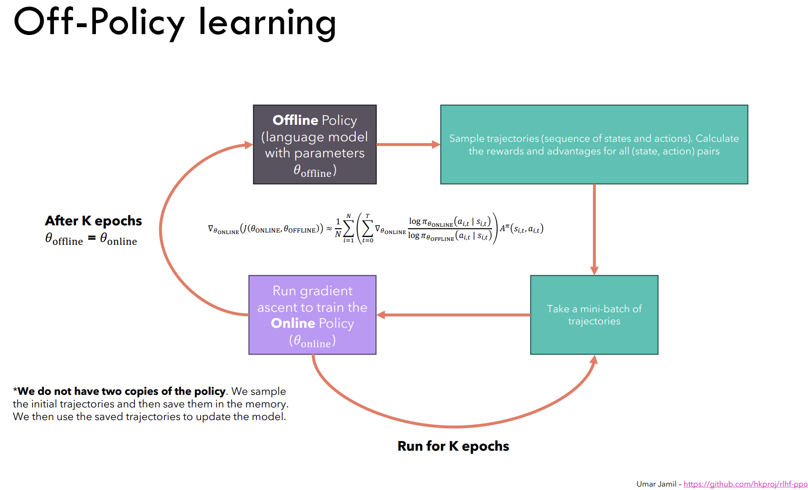
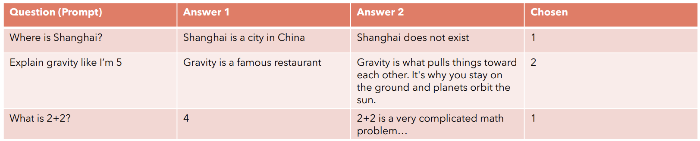

## **Limitations of Policy Gradient Optimization**
In my previous blog post, we discussed the [Policy Gradient Optimization](https://thinamxx.github.io/blog/posts/PGO/policy_gradient.html) where we derived the expression for the gradient of the objective function w.r.t the policy parameters:
$\nabla_{\theta} J(\pi_{\theta}) \approx \frac{1}{N} \sum_{i=1}^{N} \sum_{t=0}^{T} \nabla_{\theta} \log \pi_{\theta}(a_t^i | s_t^i) R(\tau^i)$. Similarly, the expression for the objective function which we want to maximize is: $J(\pi_{\theta}) = \mathbb{E}_{\tau \sim \pi_{\theta}}[R(\tau)]$. However, PGO works well in simple environments, but it can be difficult to scale to more complex environments or problems like LLMs. 

- **High Variance**: As seen in the above expression of computing the gradient of the objective function, we are approximating the expectation using samples (computing mean) which means that we are calculating the expression only on a subset of the trajectories which can lead to high variance in the gradient estimates. Therefore, the gradient approximation is unbiased which means that the average of the gradients over many samples or trajectories will eventually converge to the true gradient. In large language models, we can't easily increase the number of sample trajectories to reduce the variance because it is computationally expensive.

- **Sampling**: In PGO, we sample the trajectories from the policy (or LLMs) and compute the reward associated with the trajectory, compute the log probability of the trajectory and then combine them to compute the gradient of the objective function. This entire process is repeated multiple times for each gradient ascent step to update the policy parameters. However, this sampling process can be computationally expensive and inefficient in large language models.

## **Off-Policy Learning**
Therefore, to address the limitations of PGO, we can use the **Off-Policy Learning** which uses the technique of **Importance Sampling** (i.e. it allows us to evaluate the expectation over a distribution $X$ using samples taken from a different distribution $Y$).

Let's consider a language model with parameters $\theta_{offline}$ which is basically an **Offline Policy** (model). Then we sample the trajectories (i.e. sequence of state, action, reward) and compute the log probability and reward associated with the trajectories. We then take the mini-batch of trajectories from the above sampled trajectories and optimize the parameters of the new language model with parameters $\theta_{online}$ which is an **Online Policy** (model). After optimizing the parameters of the online policy model, we then update the parameters of the offline policy model with the parameters of the online policy model i.e. $\theta_{offline} = \theta_{online}$.

Fig a. Off-Policy Learning diagram prepared by Umar Jamil.

Therefore, using the **Off-Policy Learning** technique, we don't have to sample the trajectories from the policy model for each gradient ascent step. Instead, we can sample the trajectories and keep them in the memory buffer and use them to optimize the policy model parameters for multiple gradient ascent steps. Then we can sample the trajectories again and repeat the process. This way, we can reduce the computational cost and improve the efficiency of the policy optimization process.

## **Reward Model**
Reward model is a type of language models that are trained in such a way that they give high rewards to the choosen answers and low rewards to the not choosen answers when given a concatenated question and answer pair to the model.

Fig b. Reward Model prepared by Umar Jamil.

As shown in the above figure, we feed a series of input tokens (i.e. tokens of the concatenated question and answer pair) to a pre-trained language model (i.e. a transformer model), it generates the series of the output embeddings which are called the **hidden states**. In the context of language models, we usually consider the last hidden state to generate the new output tokens. Similarly, we will choose the last hidden state or output embedding of the language model to generate the reward for the answer fed to the model along with a particular question. We will use a Linear layer that takes the last hidden state of the language model and outputs one feature representation which is the reward for the answer. 

### **Dataset for Reward Model**
According to the paper, [Learning to summarize from human feedback](https://arxiv.org/abs/2009.01325), training reward models often involves utilizing a dataset comprised of paired comparisons between two answers generated for the same question input. The dataset is prepared by:  
- Let's consider we have a pretrained language model and we feed a question to the model and generate multiple answers for the question.
- We then ask the human experts to compare the answers and choose the best answer among them. 
- As mentioned above in the [Reward Model section](#reward-model), we then train the reward model, when given a concatenated question and answer pair, it should generate a high numerical reward for the choosen answer and a low numerical reward for the not choosen answer (i.e. the answer which is not choosen by the human expert). 

Fig c. Dataset for Reward Model prepared by Umar Jamil.

### **Loss Function for Reward Model**
Since, we now have the dataset and the procedure to train the reward model, we can define the loss function for the reward model as follows:  
$L(\theta) = -log(\sigma(r(x, y_{win}) - r(x, y_{lose})))$ where $\sigma$ is the sigmoid function, $r(x, y_{win})$ is the reward generated by the reward model for the choosen answer and $r(x, y_{lose})$ is the reward generated by the reward model for the not choosen answer.

The above loss function will have two cases:
- When $r(x, y_{win}) > r(x, y_{lose})$, it will generate a positive value which means that the sigmoid function will generate a value between 0.5 and 1.0. It will then be fed to the log function which will generate a negative value between 0 and -1.0 which will be multiplied by -1. Therefore, the loss will be a small positive value around 0 and 1.0. 
- When $r(x, y_{win}) < r(x, y_{lose})$, it will generate a negative value which means that the sigmoid function will generate a value between 0 and 0.5. It will then be fed to the log function which will generate a negative value between -1.0 and $-\inf$ which will be multiplied by -1. Therefore, the loss will be a large positive value. 

Fig d. Sigmoid and Log function used in the above explanation.

Therefore, the above loss function will penalize the reward model when it generates a high reward for the not choosen answer and a low reward for the choosen answer and vice versa as we know that the reward model will learn by minimizing the loss function.

## **Proximal Policy Optimization (PPO)**
PPO is a type of policy optimization technique in RL, aimed at effectively training a policy without jeopardizing the stability of the training process. The underlying idea behind PPO is a small, stable steps, a philosophy of gently nudging the policy towards optimization, rather than forcing aggressive updates that could potentially destabilize the overall learning process. 

In traditional RL, the principle of policy gradient mandates that the policy we want to optimize (online policy) and the policy we use to sample the trajectories (offline policy) should remain close in the parameter space. However, this proximity constraint in parameter space doesn't necessarily equate to the similar performance, and a slight variance in the parameters can drastically impact the effectiveness of the policy which can lead to a scenario often described as **falling off the cliff**.This is where PPO comes in, by ensuring that the policy updates are small and stable, it helps to prevent the policy from **falling off the cliff** and ensures that the policy remains stable throughout the training process.

### **Clipped Surrogate Objective Function** 
PPO-Clip attempts to keep the (online) policy close to the (offline) policy by introducing a **clipped surrogate objective function**. The clipped surrogate objective function is defined as follows:  
$L^{CLIP}(\theta) = \mathbb{E}_{t} [min(\frac{\pi_{\theta_{online}}(a_t | s_t)}{\pi_{\theta_{offline}}(a_t | s_t)} \hat{A}_t, clip(\frac{\pi_{\theta_{online}}(a_t | s_t)}{\pi_{\theta_{offline}}(a_t | s_t)}, 1 - \epsilon, 1 + \epsilon) \hat{A}_t)]$  
where $\frac{\pi_{\theta_{online}}(a_t | s_t)}{\pi_{\theta_{offline}}(a_t | s_t)}$ is the ratio of the online policy probability to the offline policy probability, $\hat{A}_t$ is the advantage function (i.e. it tells us how much better a particular action is compared to the average action in a particular state), and $\epsilon$ is the hyperparameter that determines how much the online policy can deviate from the offline policy. The clip function limits the ratio of the online policy probability to the offline policy probability to the range of $[1 - \epsilon, 1 + \epsilon]$ which ensures that the policy updates are small and stable. 

### **Value Function Estimation**
In PPO, the value function is used to estimate the expected reward we can receive by starting from a particular state and following a particular policy. The learning objective for the value function estimator (or model) is to minimize the discrepancy between the predicted value and the actual reward value. The value function estimator is trained using the following loss function:  
$L^{VF}(\theta) = \mathbb{E}_{t} [(V_{\theta}{(s_t)} - \hat{R}_t)^2]$  
where $V_{\theta}{s_t}$ is the model's predicted value for the state $s_t$ with parameters $\theta$ and $\hat{R}_t$ is the actual reward value for the state $s_t$ and can be estimated as $\hat{R}_t = \sum_{i=0}^{T} \gamma^i r_{t+i}$ where $\gamma$ is the discount factor and $r_{t+i}$ is the reward received at time step $t+i$ from the sampled trajectory.

### **PPO Loss Function**
The overall loss function for the PPO is a combination of the clipped surrogate objective function, the value loss function and entropy loss function. The entropy loss function is used to encourage the policy to explore more options and prevent it from getting stuck in a local optima. If we don't include the entropy loss function, the policy or (model) will always choose the same action in a particular state that has the highest advantage value. The entropy loss function is defined as: $L^{ENT}(\theta) = -\sum_{a} \pi_{\theta}(a | s) \log \pi_{\theta}(a | s)$ where $\pi_{\theta}(a | s)$ is the probability of taking action $a$ in state $s$.

Therefore, the overall loss function for the PPO is defined as:  
$L(\theta) = L^{CLIP}(\theta) - c_1 L^{VF}(\theta) + c_2 L^{ENT}(\theta)$  
where $c_1$ and $c_2$ are the hyperparameters that determine the weight of the value loss function and entropy loss function in the overall loss function.

## **KL Divergence**
KL Divergence is an alternative to the clipped surrogate objective function, which introduces a constraint on the policy updates by regularizing and ensuring that the KL divergence remains within a certain threshold. The expression for the KL divergence is defined as:  
$L^{KL}(\theta) = \mathbb{E}_{t} [\frac{\pi_{\theta_{online}}(a_t | s_t)}{\pi_{\theta_{offline}}(a_t | s_t)} \hat{A}_t - \beta KL(\pi_{\theta_{offline}}(a_t | s_t) || \pi_{\theta_{online}}(a_t | s_t))]$  
where $\beta$ is the hyperparameter that determines the weight of the KL divergence in the overall loss function. The KL divergence ensures that the policy updates are small and stable by regularizing the policy updates and preventing the policy from deviating too far from the offline policy.

## **Conclusion**
In this blog post, we discussed the limitations of the Policy Gradient Optimization (PGO) and how we can address these limitations using the Off-Policy Learning technique. We also discussed the Reward Model, the dataset for training the reward model, the loss function for the reward model, and the importance of the reward model in training large language models. We then discussed the Proximal Policy Optimization (PPO) technique, the clipped surrogate objective function, the value function estimation, the overall loss function for the PPO, and the KL divergence. We also discussed the importance of the entropy loss function in the overall PPO loss and how it encourages the policy to explore more options and prevent it from getting stuck in a local optima.

## **References**
1. Stiennon, N., Ouyang, L., Wu, J., Ziegler, D. M., Lowe, R., Voss, C., Radford, A., Amodei, D., & Christiano, P. (2020). Learning to summarize from human feedback. ArXiv. /abs/2009.01325
2. Zheng, R., Dou, S., Gao, S., Hua, Y., Shen, W., Wang, B., Liu, Y., Jin, S., Liu, Q., Zhou, Y., Xiong, L., Chen, L., Xi, Z., Xu, N., Lai, W., Zhu, M., Chang, C., Yin, Z., Weng, R., . . .  Huang, X. (2023). Secrets of RLHF in Large Language Models Part I: PPO. ArXiv. /abs/2307.04964
3. Mnih, V., Kavukcuoglu, K., Silver, D., Graves, A., Antonoglou, I., Wierstra, D., & Riedmiller, M. (2013). Playing Atari with Deep Reinforcement Learning. ArXiv. /abs/1312.5602
4. Li, Y. (2018). Deep Reinforcement Learning. ArXiv. /abs/1810.06339
5. [Reinforcement Learning from Human Feedback explained with math derivations and the PyTorch code.](https://youtu.be/qGyFrqc34yc?si=cOgbI5qslTJ2JFes)
6. [Intro to Policy Optimization](https://spinningup.openai.com/en/latest/spinningup/rl_intro3.html)
7. [Deep Reinforcement Learning: Pong from Pixels](https://karpathy.github.io/2016/05/31/rl/)