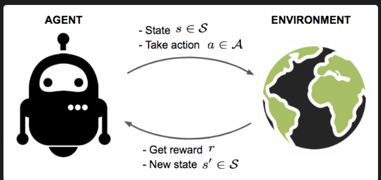
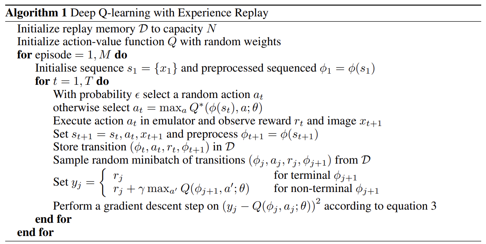

I am going to write a series of posts on Reinforcement Learning. This post is the first post in the series. In this post, I will introduce the basic concepts of Reinforcement Learning.

## **What is Reinforcement Learning?**  
Reinforcement Learning is a technique in machine learning that enables an **agent** to learn how to behave in an environment by performing actions and observing the rewards. The **agent** learns to achieve a goal by interacting with the environment. The **agent** learns by trial and error, and the goal is to maximize the cumulative reward. 

Fig a. An agent interactivng with environment

In the above figure, the **agent** at state $s$ takes an action $a$ on the given **environment**. The **environment** returns the reward $r$ and the next state $s'$ based on the action performed at the given state $s$. The **agent** learns from the reward and the next state and takes the next action in such a way that it maximizes the cumulative reward.

### **State, Action, Reward, Transition Probability, Discounted Reward & Trajectory**  
An RL agent interacts with the environment over time. At each time step $t$, the agent receives a state $s_t$ in a state space $S$, and selects an action $a_t$ from an action space $A$, following a policy $\pi(a_t|s_t)$, which is the agent's strategy for selecting actions or mapping from state $s_t$ to action $a_t$. The agent receives a scalar reward $r_t$, and transitions to the next state $s_{t+1}$ according to the environment's dynamics. The environment's dynamics are defined by the transition probability $P(s_{t+1}|s_t, a_t)$, which is the probability of transitioning to state $s_{t+1}$ given that the agent was in state $s_t$ and took action $a_t$. The agent's goal is to learn a policy $\pi$ that maximizes the expected cumulative reward, which is the sum of rewards over time, typically with a discount factor $\gamma$ to give more weight to immediate rewards.

In Reinforcement Learning, the agent is interacting with the **environment**. **Environment** is a system or a model that defines how the agent should interact or take actions to move from one state to another state. **State** ($s \epsilon S$) is the current situation or characteristics of the agent in the environment. **Action** ($a \epsilon A$) is the decision taken by the agent at the given state. **Reward** ($r$) is the feedback from the environment based on the action taken by the agent. **Transition Probability** $P(s'|s,a)$ is the probability of moving from state $s$ to state $s'$ by taking action $a$. **Discounted Reward** is the reward that is discounted by a factor $\gamma$ and it is used to give more importance to the immediate reward than the future reward.

A **trajectory** is a sequence of states, actions, and rewards that the agent encounters while interacting with the environment. The trajectory is denoted by $\tau = (s_0, a_0, r_0, s_1, a_1, r_1, s_2, a_2, r_2, ...)$.

### **Policy**  
A policy which is denoted by $\pi$ is a mapping from states to actions that tells the agent what action to take in a given state. The policy can be deterministic or stochastic. A **deterministic policy** is a direct mapping from states to actions, while **stochastic policy** is a probability distribution over actions given states.

A policy maps a state to an action, or, a distribution over actions, and policy optimization is the process of finding the optimal mapping. Value based methods optimize the value function first, then derive the optimal policies. Policy based methods optimize the objective function directly, or usually the cumulative rewards. 

The objective of the agent is to find the optimal policy $\pi^*$ that maximizes the cumulative discounted reward. Mathematically, the objective is given by: $\displaystyle\sum_{t>0} \gamma r_t$

### **Value Funtion**  
The value function is a function that estimates the expected cumulative reward that the agent can achieve by following a policy $\pi$ from a given state $s$. The value function is denoted by $V^{\pi}(s)$ and it is defined as the expected cumulative reward that the agent can achieve by following a policy $\pi$ from a given state $s$. The value function is defined as: $V^{\pi}(s) = E_{\pi}[ \displaystyle\sum_{t>0} \gamma^t r_t | s_0 = s,\pi ]$

### **Q-Value Function**
The Q-value function is a function that estimates the expected cumulative reward that the agent can achieve by taking action $a$ at state $s$ and following a policy $\pi$ thereafter. The Q-value function is denoted by $Q^{\pi}(s,a)$ and it is defined as the expected cumulative reward that the agent can achieve by taking action $a$ at state $s$ and following a policy $\pi$ thereafter. The Q-value function is defined as: $Q^{\pi}(s,a) = E_{\pi}[ \displaystyle\sum_{t>0} \gamma^t r_t | s_0 = s, a_0 = a,\pi ]$

The optimal Q-value function is denoted by $Q^*(s,a)$ and it is defined as the maximum expected cumulative reward that the agent can achieve by taking action $a$ at state $s$ and following the optimal policy $\pi^*$ thereafter. The optimal Q-value function is defined as: $Q^*(s,a) = maxE_{\pi^*}[ \displaystyle\sum_{t>0} \gamma^t r_t | s_0 = s, a_0 = a,\pi^* ]$

## **Q-Learning**  
The optimal Q-value function as known as the optimal action-value function obeys the **Bellman Equation**. The Bellman Equation is based on the intuition that if the optimal action-value function $Q^*(s', a')$ of the sequence of states $s'$ and the next time step is known for all possible actions $a'$, then the optimal action-value function $Q^*(s,a)$ of the current state $s$ and the current action $a$ can be calculated. The Bellman Equation is given by: $Q^*(s,a) = E_{s',r}[r + \gamma max_{a'} Q^*(s',a') | s,a]$. 

The **Q-Learning** algorithm is based on the Bellman Equation and it is used to estimate the optimal Q-value function $Q^*(s,a)$ by iteratively updating the Q-value function $Q(s,a)$ using the Bellman Equation such that: $Q_{i+1}(s,a) = E[ r + \gamma max_{a'} Q_i(s',a') | s,a]$. In practice, this approach is totally impractical because the action-value function is estimated separately for each state-action pair without generalizing the knowledge across states. Instead, we use a function approximator to estimate the Q-value function: $Q^*(s,a) \approx Q(s,a;\theta)$ which introduces **Deep Q-Network (DQN)**.

### **Deep Q-Network (DQN)**  
Deep Q-Network (DQN) is a neural network (non-linear function approximator) that is used to estimate the action-value function $Q(s,a;\theta)$ in Q-Learning with weights given by $\theta$. The DQN is trained to minimize the loss function given by: $L_i(\theta_i) = E_{s,a \sim \rho(.)} [(y_i - Q(s,a;\theta_i))^2]$, where $y_i = E_{s' \sim \epsilon} [r + \gamma max_{a'} Q(s',a';\theta_{i-1}) | s,a]$ is the target value for iteration $i$ and $\rho(s, a)$ is a probability distribution over states and actions which is also known as the behavior distribution. The parameters from the previous iteration $\theta_{i-1}$ are held fixed while optimizing the loss function $L_i(\theta_i)$.

When differentiating the loss function $L_i(\theta_i)$ with respect to the weights $\theta_i$, the gradient of the loss function is given by: $\nabla_{\theta_i} L_i(\theta_i) = E_{s,a \sim \rho(.); s' \sim \epsilon} [(r + \gamma max_{a'} Q(s',a';\theta_{i-1}) - Q(s,a;\theta_i)) \nabla_{\theta_i} Q(s,a;\theta_i)]$. The gradient of the loss function is used to update the weights $\theta_i$ using the gradient descent algorithm.

The **Deep Q-Network (DQN)** algorithm is a model-free: it solves the reinforcement learning task directly using the samples from the environment, without explicitly estimating the transition probability. It is an off-policy algorithm: it learns about the greedy policy $a = argmax_{a} Q(s,a;\theta)$ while following the behavior distribution $\rho(s,a)$. 

Fig b. Deep Q-Network algorithm taken from <a href="https://arxiv.org/abs/1312.5602" target="_blank">Mnih et al.</a>

Deep Q-Networks make a big leap in the field of Reinforcement Learning by showing that Q-Learning with a non-linear function approximation, in particular, deep convolutional neural networks, can achieve outstanding results on a wide range of Atari games. 

#### **Double DQN**  
In standard Q-Learning, and in DQN, the parameters are updated as follows:   
$\theta_{i+1} = \theta_i + \alpha (y_i - Q(s_i,a_i;\theta_i)) \nabla_{\theta_i} Q(s_i,a_i;\theta_i)$  
where $y_i = r + \gamma max_{a'} Q(s_{i+1}',a_i';\theta_{i-1})$.

The problem with this approach is that the Q-values are overestimated because the same values are used to select and evaluate an action. So, the Double DQN algorithm proposes to evaluate the greedy policy according to the online network, but to use the target network to estimate its value. This can be achieved by:  
$\theta_{i+1} = \theta_i + \alpha (y_i - Q(s_i,a_i;\theta_i)) \nabla_{\theta_i} Q(s_i,a_i;\theta_i)$  
where $y_i = r_{i+1} + \gamma Q(s_{i+1}',argmax_{a'} Q(s_{i+1}',a';\theta_i);\theta_{i-1})$.

#### **Dueling DQN Architecture**  
Dueling DQN architecture propse the dueling network architecture to estimate the state value function $V(s)$ and the associated advantage function $A(s,a)$ and then combine them to estimate the action-value function $Q(s,a)$ to converge faster than Q-Learning. In DQN, a CNN Layer is followed by a fully connected layer but in Dueling DQN, a CNN Layer is followed by two streams of fully connected layers: one for the state value function $V(s)$ and the other for the advantage function $A(s,a)$. The output of the two streams is combined to estimate the action-value function $Q(s,a)$.

## **Conclusion**
In this post, I have introduced the basic concepts of Reinforcement Learning. I have discussed the concepts of State, Action, Reward, Transition Probability, Discounted Reward, Trajectory, Policy, Value Function, Q-Value Function, Q-Learning, Deep Q-Network (DQN), Double DQN, and Dueling DQN.

## **References**  
1. Mnih, V., Kavukcuoglu, K., Silver, D., Graves, A., Antonoglou, I., Wierstra, D., & Riedmiller, M. (2013). Playing Atari with Deep Reinforcement Learning. ArXiv. /abs/1312.5602
2. Li, Y. (2018). Deep Reinforcement Learning. ArXiv. /abs/1810.06339
3. [Reinforcement Learning from Human Feedback explained with math derivations and the PyTorch code.](https://youtu.be/qGyFrqc34yc?si=cOgbI5qslTJ2JFes)