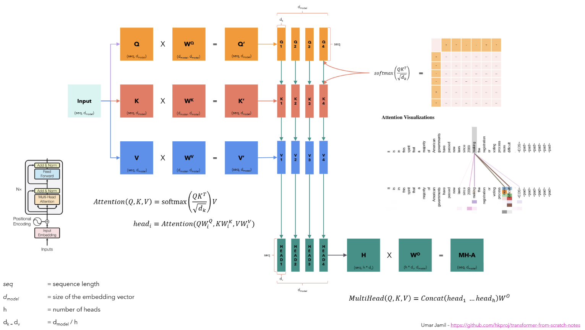

## 1. Introduction to Multi-Head Attention  
At first, we need to understand the multi-head attention mechanism. In the Transformer model, the **attention mechanism** is used to capture the relationship between all the tokens in the input sequence along with its positional information. The attention mechanism is the key algorithm behind the success of the Transformer model. In the following figure, the attention mechanism is computed by the following formula:  

$$
\text{Attention}(Q, K, V) = \text{softmax}\left(\frac{QK^T}{\sqrt{d_k}}\right)V
$$

If we are talking about the vanilla self-attention mechanism, then the same input sequence is converted into a sequence of vectors $Query (Q)$, $Key (K)$, and $Value (V)$ by using the linear projection $W_Q$, $W_K$, and $W_V$ respectively as shown in the following figure. On the other hand, we use two input sequences in the case of cross-attention mechanism, which undergoes the same process of linear projection with weighted matrices $W_Q$, $W_K$, and $W_V$. 

<div style="display: flex; flex-direction: column; align-items: center;">

<p style="text-align: center;">Fig a. The image taken from Umar's video clearly presents the multi-head attention mechanism.</p>
</div>

So, the steps to compute the complete multi-head attention mechanism as shown in the figure above are as follows:  
1. The input sequence is converted into a sequence of vectors $Q$, $K$, and $V$, each of size $(seq\_len \times d\_model)$, where $seq\_len$ is the length of the input sequence and $d\_model$ is the dimension of the embedding vector. The sequence of $Q$, $K$, and $V$ vectors then undergo the linear projection with the weighted matrices $W_Q$, $W_K$, and $W_V$ of size $(d\_model \times d\_model)$ respectively, to obtain the $Query$, $Key$, and $Value$ matrices of size $(seq\_len \times d\_model)$.  
2. The $Query$, $Key$, and $Value$ matrices are then split into $h$ heads, where $h$ is the number of heads. Each head is then processed independently in parallel to compute the attention mechanism. In the above figure, we have $h = 4$ heads, so the $Query$, $Key$, and $Value$ matrices are split into 4 heads, each of size $(seq\_len \times \frac{d\_model}{h}) = (seq\_len \times d\_k)$.
3. Then, we compute the attention independently for each head using the formula, where $d_k$ is the dimension of each head:  

$$
\text{Attention}(Q, K, V) = \text{softmax}\left(\frac{QK^T}{\sqrt{d_k}}\right)V
$$

4. Finally, the attention for each head is concatenated to obtain the complete embedding vector of size $(seq\_len \times d\_k * h) = (seq\_len \times d\_model)$ and passed through a linear layer $W_O$ of size $(d\_model \times d\_model)$ to obtain the final output.  

Please note that we will be reading alot about the **flash attention** in this blog series on **triton**. The **flash attention** is a highly optimized implementation of the attention mechanism that optimizes the computation of $\text{softmax}\left(\frac{QK^T}{\sqrt{d_k}}\right)$. The linear projection to obtain $Query$, $Key$, and $Value$ matrices is just a matrix multiplication between the input sequence and the weight matrices $W_Q$, $W_K$, and $W_V$ respectively.   


## 2. Internal Working of Attention Implementation  
The naive implementation of attention in PyTorch is done in 3 steps:
1. $S = QK^T \in \mathbb{R}^{seq\_len \times seq\_len}$
2. $P = \text{softmax}(S) \in \mathbb{R}^{seq\_len \times seq\_len}$
3. $O = PV \in \mathbb{R}^{seq\_len \times d\_model}$ 

- First, all these tensors are stored in the global memory of the GPU. The GPU has a memory hierarchy, where the fastest memory is the *shared memory* and the slowest memory is the *global memory* also known as the *DRAM or HBM*. 

- The problem with the naive implementation is that these tensors are stored in the global memory, which is very slow and a lot of time is wasted in accessing the data, rather than doing the actual computation, and it is referred as *memory access overhead*. 

- The solution to this problem is to use the *shared memory* to do the actual attention computation. But, the shared memory is limited in size and much closer to the GPU cores. So, we need to split the tensors into smaller blocks that can fit into the shared memory and the process is called **tiling** or **block matrix multiplication**, which runs parallelly on the GPU cores. In this case, the output of the attention computation is stored in the global memory. 

- The **softmax** operation converts the output of the dot product of the query and key matrices into a probability distribution row-wise, which means that the sum of all the elements in each row of the output matrix $P$ is 1. 

## 3. Online Softmax Implementation  
We mentioned above that the **block matrix multiplication** is used to compute the attention mechanism in the shared memory to avoid the memory access overhead of the naive attention implementation. But, the problem with this approach is **softmax** operation. Let me explain this in detail below. 

We know that the softmax operation is computed as follows: 

Given a vector $x = [x_1, x_2, ..., x_n]$, the softmax operation is computed as follows:  

$$
\text{softmax}(x_i) = \frac{e^{x_i}}{\sum_{j=1}^{n} e^{x_j}}
$$

Here, the denominator of the softmax function also called as *normalization factor* is computed by summing up the exponential of all the elements of a particular row of the matrix $S$, or in other words, the sum of the exponential of all the elements in the input sequence. 

### 3.1. Numerical Instability   
If the vector $x$ is very large, suppose $x_i = 1000000$, then the exponential of $x_i$ might be very large that it can't be stored in the floating point number representation, which is called as **overflow** or **numerical instability**.

So, we can use the following trick to avoid the numerical instability problem: 
$$
\begin{align*}
\text{softmax}(x_i) &= \frac{e^{x_i}}{\sum_{j=1}^{n} e^{x_j}} \\
                    &= \frac{c.e^{x_i}}{c.\sum_{j=1}^{n} e^{x_j}} \\    
                    &= \frac{c.e^{x_i}}{\sum_{j=1}^{n} c.e^{x_j}} \\    
                    &= \frac{e^{log(c)}.e^{x_i}}{\sum_{j=1}^{n} e^{log(c)}.e^{x_j}} \\  
                    &= \frac{e^{log(c) + x_i}}{\sum_{j=1}^{n} e^{log(c) + x_j}} \\    
                    &= \frac{e^{x_i - k}}{\sum_{j=1}^{n} e^{x_j - k}}
\end{align*}
$$

where $c$ is a constant and it can be replaced by another constant $k$ assuming that $k = -log(c)$. So, the final equation obtained above presents that, we can add a constant value to the exponential operation and if chosen correctly, it can control the numerical instability problem by controlling the value of exponential.

Let's choose the constant $k = max(x)$, which is the maximum value in the input sequence. Then the value of argument $x_i - k$ will be negative or zero for all the elements in the input sequence. So, the exponential of the argument will be in the range of $0$ to $1$, which can be easily stored or represented in the floating point number representation. 

So, the final algorithm to compute the **softmax operation** in such a way that it can avoid the numerical instability problem is as follows:  
1. We now know that the softmax operation is computed as:

$$
\text{softmax}(x_i) = \frac{e^{x_i - x_{max}}}{\sum_{j=1}^{n} e^{x_j - x_{max}}}
$$

2. Assuming that we have a $N,N$ matrix, then for each row $i$,
- Compute the maximum value of the row $x_{max} = max(x_i)$
- Compute the exponential of the row $e^{x_i - x_{max}}$
- Compute the sum of the exponential of the row $\sum_{j=1}^{n} e^{x_j - x_{max}}$
- Compute the softmax of the row $\text{softmax}(x_i) = \frac{e^{x_i - x_{max}}}{\sum_{j=1}^{n} e^{x_j - x_{max}}}$

3. The pseudocode for the above algorithm is as follows:  

```python
# maximum value of the row.
m_0 = -float('inf')

for i in range(N):
    # compute the maximum value of the row.
    m_i = max(m_(i-1), x[i]) 

# sum of the exponential of the row or normalization factor.
l_0 = 0  
for j in range(N):
    # compute the sum of the exponential of the row.
    l_j = l_(j-1) + exp(x[j] - m_N)

# compute the softmax of the row.
for k in range(N):
    y[k] = exp(x[k] - m_N) / l_N
```

4. Let's now demonstrate the above algorithm with an example:

```python
x = [6, 7, 8, 3]

# 1. compute the maximum value: 
m_N = max(x) 
    = 8

# 2. compute the normalization factor: 
l_N = exp(6 - 8) + exp(7 - 8) + exp(8 - 8) + exp(3 - 8) 
    = exp(-2) + exp(-1) + exp(0) + exp(-5) 
    = 0.1353 + 0.3679 + 1 + 0.0067 = 1.5099

# 3. compute the softmax:
y = [exp(6 - 8) / l_N, exp(7 - 8) / l_N, exp(8 - 8) / l_N, exp(3 - 8) / l_N] 
  = [0.1353 / 1.5099, 0.3679 / 1.5099, 1 / 1.5099, 0.0067 / 1.5099] 
  = [0.0897, 0.2438, 0.6631, 0.0044]
```

Note that, in this **softmax operation**, if we have a matrix of size $(N, N)$, we have to load each of it's element 3 times, which is not efficient. Also, the **softmax operation** is sequential, which means that we have to complete steps #1, #2, and #3 in a sequential manner. So, we need to find a way to compute the softmax operation in a more efficient way. 

### 3.2. Online Softmax 
So, the problem statement is to compute the softmax operation of a vector without loading the entire vector elements 3 times, but also preventing the exponential overflow problem. 

At first, let's understand the traditional softmax implementation by using the above example showing the sequential steps:

```python
x = [6, 7, 8, 3]

# 1. compute the maximum value:
m_0 = -float('inf')
m_1 = max(m_0, x[0]) = max(-float('inf'), 6) = 6
m_2 = max(m_1, x[1]) = max(6, 7) = 7
m_3 = max(m_2, x[2]) = max(7, 8) = 8
m_4 = max(m_3, x[3]) = max(8, 3) = 8

# 2. compute the normalization factor: 
l_0 = 0
l_1 = l_0 + exp(x[0] - m_4) = 0 + exp(6 - 8) = 0.1353
l_2 = l_1 + exp(x[1] - m_4) = 0.1353 + exp(7 - 8) = 0.1353 + 0.3679 = 0.5032
l_3 = l_2 + exp(x[2] - m_4) = 0.5032 + exp(8 - 8) = 0.5032 + 1 = 1.5032
l_4 = l_3 + exp(x[3] - m_4) = 1.5032 + exp(3 - 8) = 1.5032 + 0.0067 = 1.51

# 3. compute the softmax:
x_0 = exp(x[0] - m_4) / l_4 = exp(6 - 8) / 1.51 = 0.1353 / 1.51 = 0.0897
x_1 = exp(x[1] - m_4) / l_4 = exp(7 - 8) / 1.51 = 0.3679 / 1.51 = 0.2438
x_2 = exp(x[2] - m_4) / l_4 = exp(8 - 8) / 1.51 = 1 / 1.51 = 0.6631
x_3 = exp(x[3] - m_4) / l_4 = exp(3 - 8) / 1.51 = 0.0067 / 1.51 = 0.0044
y = [0.0897, 0.2438, 0.6631, 0.0044]
```

Now, let's fuse the computation of the maximum value and the normalization factor:

```python
x = [6, 7, 8, 3]

# 1. compute the maximum value and the normalization factor:
m_1 = max(0, 6) = 6
l_1 = exp(6 - 6) = 1

m_2 = max(6, 7) = 7
l_2 = l_1 + exp(7 - 7) = 1 + 1 = 2

# Problem: 
# so, while computing the l_2, we use the maximum value as m_2 which means 
# that the maximum value used to compute l_1 is not correct because 
# we have used the local maximum not the global maximum of the input sequence. 

# Solution:
# so, while computing the normalization factor l_1, l_2, ..., l_N, 
# we need to use the correction factor i.e exp(m_(i-1), m_i). 
# therefore, l_i = l_(i-1) * exp(m_(i-1) - m_i) + exp(x_i - m_i)

# Now, let's reiterate the above computation steps:
# 1. compute the maximum value and the normalization factor: 
m_1 = max(0, 6) = 6
l_1 = 0 + exp(6 - 6) = 1

m_2 = max(6, 7) = 7
l_2 = l_1 * exp(6 - 7) + exp(7 - 7) 
    = 1 * exp(-1) + 1 = 1.3679

m_3 = max(7, 8) = 8
l_3 = l_2 * exp(7 - 8) + exp(8 - 8) 
    = 1.3679 * exp(-1) + 1 
    = 1.3679 * 0.3679 + 1 
    = 1.5099

m_4 = max(8, 3) = 8
l_4 = l_3 * exp(8 - 8) + exp(3 - 8) 
    = 1.5099 * 1 + 0.0067 
    = 1.51
```

We can see that, the maximum value and the normalization factor are computed in a single pass which means that we decrease the requirement of loading the entire vector elements 3 times to 2 times, therefore, the new pseudocode for the softmax implementation is as follows:

```python
# maximum value and normalization factor of the row.
m_0 = -float('inf')
l_0 = 0
for i in range(N):
    m_i = max(m_(i-1), x[i]) 
    l_i = l_(i-1) * exp(m_(i-1) - m_i) + exp(x[i] - m_i)

# compute the softmax of the row.
for k in range(N):
    y[k] = exp(x[k] - m_N) / l_N
```

### 3.3. Implementation of Online Softmax
Let's now implement the original softmax with 3-pass as well as the online softmax with 2-pass in Python. 

```python
def original_softmax(x):
    """Traditional 3-pass implementation of softmax."""

    # 1. compute the maximum value of the row.
    m_n = float("-inf")
    for val in x:
        m_n = max(m_n, val)

    # 2. compute the normalization factor.
    l_n = 0
    for val in x:
        l_n += np.exp(val - m_n)

    # 3. compute the softmax values.
    output = np.zeros_like(x)
    for i, val in enumerate(x):
        output[i] = np.exp(val - m_n) / l_n

    return output


def online_softmax(x):
    """Online (2-pass) implementation of softmax."""

    # 1. compute the maximum value and the normalization factor.
    m_prev = float("-inf")
    l_prev = 0

    for val in x:
        m_curr = max(m_prev, val)
        l_curr = l_prev * np.exp(m_prev - m_curr) + np.exp(val - m_curr)
        m_prev = m_curr
        l_prev = l_curr

    # 2. compute the final softmax values.
    output = np.zeros_like(x)
    for i, val in enumerate(x):
        output[i] = np.exp(val - m_prev) / l_prev

    return output
```

### **Conclusion**
In this blog, we discussed the details of the multi-head attention mechanism and how **block matrix multiplication** is used to compute the attention mechanism in the shared memory to avoid the memory access overhead of the naive attention implementation. Also, we discussed the cons of **softmax** operation in the **block matrix multiplication** approach showing the numerical instability problem and the need of loading the entire vector elements 3 times. Finally, we discussed the **online softmax** implementation which is a more efficient way to compute the softmax operation of a vector without loading the entire vector elements 3 times, but also preventing the exponential overflow problem.

In the next blog, we will continue the discussion of **block matrix multiplication** and **flash attention** and how we can use the **triton** library to implement the custom kernel for the attention mechanism. 